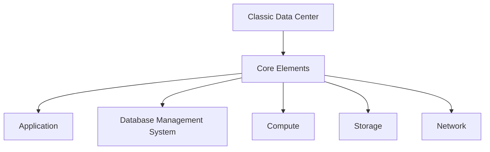
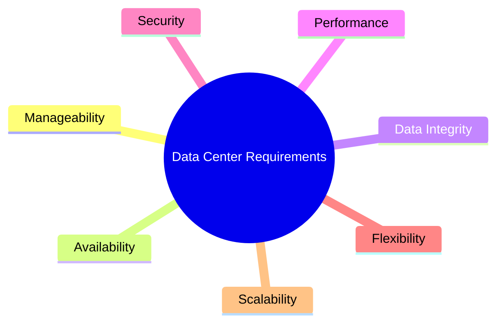
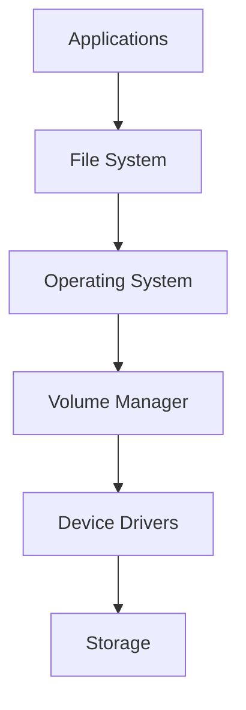

# 📚 Cloud & Big Data Exam Notes: Classic Data Center (CDC) - The Lazy Way

> [!NOTE] This is a super quick, no-fluff guide. Just hit the key points.

---

## ☁️ Module 2: Classic Data Center (CDC) Basics

### 🎯 What You Should Know (High-Level)
You need to understand:
*   What a CDC is made of (compute, storage, network).
*   How storage networking works in a CDC.
*   How to keep things running (business continuity).
*   How to manage a CDC.

### 🏢 What's a Classic Data Center (CDC)?
*   It's just a building/facility full of physical IT stuff.
*   Think: computers (servers), wires (network), and hard drives (storage).

#### Core Elements of a CDC (Memorize this!)

*   **Application**: The software people actually use (email, ERP, etc.).
*   **DBMS**: Software to manage your data (like MySQL, Oracle).
*   **Compute**: The brain/muscle (servers, CPUs, memory).
*   **Storage**: Where data lives persistently (hard drives, SSDs).
*   **Network**: The roads data travels on (cables, switches).

### 🔑 Key Requirements of a Data Center
Think of these as the "must-haves" for any good data center.

*   **Availability**: Always on, never dies.
*   **Data Integrity**: Data is correct, not corrupted.
*   **Performance**: Fast, responsive.
*   **Security**: Protected from bad guys.
*   **Flexibility**: Can adapt to new needs.
*   **Scalability**: Can grow big without breaking.
*   **Manageability**: Easy to run and maintain.

---

## 💻 Lesson 1: App, DBMS, Compute, Storage - The Nitty Gritty

### 🖥️ Applications
*   **What they do**: Business stuff (Email, ERP, Decision Support, Data Warehouse), management, data protection (backup!), security (antivirus, login checks).
*   **I/O Stuff**:
    *   **Read vs. Write Intensive**: Apps mostly reading data (e.g., search engines) or mostly writing data (e.g., transaction systems).
    *   **Sequential vs. Random**: Data accessed one after another (like a video stream) or jumping all over the place (like a database).

### 🗄️ Database Management System (DBMS)
*   **What it is**: A smart way to store data in organized tables. Makes finding data fast.
*   **What it does**: Takes app requests, talks to the OS, gets your data.
*   **Examples**: MySQL, Oracle, SQL Server. You probably know these.

### 🧠 Compute
*   **Simply**: The thing that *runs* your applications.
*   **Parts**:
    *   **Physical**: CPU (brain), Memory (short-term memory), I/O devices (input/output, like keyboards, network cards).
    *   **Logical**: Software and rules (protocols) that make it all work.
*   **Communication**:
    *   **You to Computer**: Keyboard, mouse.
    *   **Computer to Storage/Other Computers**: Special cards called "host controllers" or "host adapters."

#### Compute System Examples
*   Your **Laptops/Desktops** (small scale).
*   **Blade Servers**: Think super-efficient, compact servers. They pack a lot of power into a small box, easy to add/remove. Good for saving space and power.
*   **Server Clusters**: Many servers working together.
    *   **Why?**: If one server dies, others take over (**availability**) and they can handle more work (**performance**).
    *   **Heartbeat**: Servers send little "I'm alive!" signals to each other. If a signal stops, they know a server is down and start the "failover" process (redirecting workload).
*   **Mainframes**: Big, old, super-powerful computers for huge, critical tasks.

#### Logical Components of Compute (The Software Stack)
This is how an application talks down to the storage.

*   **Applications**: What you run.
*   **File System**: Organizes files on disk (like folders on your PC).
*   **Operating System (OS)**: Windows, Linux, etc. Manages everything.
*   **Volume Manager**: Groups disks, manages how data is spread across them.
*   **Device Drivers**: Software that lets the OS talk to specific hardware (like your hard drive).
*   **Storage**: Where the data actually sits.

### 💾 Storage
*   **Purpose**: To keep your data *forever* (or until you delete it). Necessary for any future use.
*   **Choice Matters**: The type of storage depends on what data you have and how fast you need to access it.
*   **Types of Media**:
    *   **Magnetic**: Good old hard disk drives (HDDs).
    *   **Optical**: CDs, DVDs (Write Once Read Many - WORM). Limited use now.
    *   **Solid State**: Flash drives, Solid State Drives (SSDs).

#### Storage Device Options (The Pros & Cons)

| Device Type      | Pros                                        | Cons                                                    |
| :--------------- | :------------------------------------------ | :------------------------------------------------------ |
| **Tape Drive**   | *Super cheap* for long-term storage.      | *Slow* (sequential access), physical wear.              |
| **Optical Disk** | WORM (Write Once Read Many), okay for small stuff. | *Limited capacity*, *slow*.                             |
| **Disk Drive**   | *Most popular*, good capacity, random access. | *Mechanical parts* (can fail), slower than SSDs.        |
| **Solid State Drive (SSD)** | *Ultra-high performance*, low latency, low power, *very fast*. | *More expensive* per GB than HDDs (but prices drop).    |

### 🛡️ Redundant Array of Independent Disks (RAID)
*   **What it is**: Not just one hard drive, but *multiple* drives working together as one unit.
*   **Why use it?**:
    *   **Protection**: If one drive fails, your data is safe (redundancy).
    *   **Capacity**: More space than a single drive.
    *   **Performance**: Can read/write data to multiple disks at once, making it faster.
*   **Core Techniques**:
    *   **Striping**: Spreading data across multiple disks (for speed).
    *   **Mirroring**: Copying data exactly to another disk (for safety).
    *   **Parity**: Smart way to rebuild data if a disk fails, using less space than mirroring. (Like a checksum for data recovery).

---