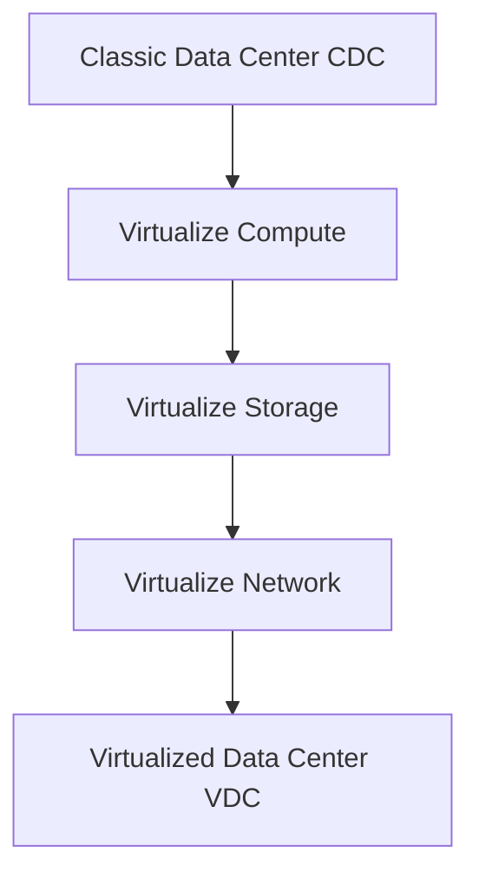

# 📚 Cloud & Big Data Exam Notes: Virtualized Data Center - Compute (Lazy Edition)

> [!NOTE] This module is about making one physical computer act like many. It's the core of cloud!

---

## ☁️ Module 3: Virtualized Data Center – Compute

### 🎯 What You Need to Know
*   What is compute virtualization?
*   How do we do it? (Techniques)
*   What makes up a VM?
*   How do we manage resources in this virtual world?
*   How do we turn old physical machines into shiny new VMs?

### 🏢 From Classic to Virtualized Data Center (VDC)
*   A VDC is just a Classic Data Center (CDC) but with everything virtualized.
*   **Big idea**: Instead of one server doing one job, one powerful server does MANY jobs (VMs).


*(You take your old stuff, virtualize it step by step, and boom, VDC!)*

## 🚀 Lesson 1: Compute Virtualization Overview

### 💡 What is Compute Virtualization?
*   **Fancy talk**: Masking/abstracting physical hardware.
*   **Simple talk**: Making one physical computer run *multiple* Operating Systems (OSs) and applications *at the same time*.
*   **VM (Virtual Machine)**: It's a "fake" computer. Looks and acts like a real one, but it's just software on a physical machine. Each VM has its own OS and apps.
*   **Hypervisor**: The magic software layer that sits between the hardware and the VMs. It makes it all possible.

    ![[Pasted image 20240722141549.png]]
    *(See how the "Virtualization Layer" (Hypervisor) sits on the hardware, and multiple VMs run on top.)*

### 🤔 Why do we need it? (Benefits!)
This table is your exam cheat sheet for "Why Virtualize?"

| Before Virtualization                      | After Virtualization (Benefits)                                 |
| :----------------------------------------- | :-------------------------------------------------------------- |
| One OS per machine (wastes hardware)       | **Server Consolidation**: Run *multiple* OSs on one machine. |
| Software & hardware tightly coupled        | **Hardware Independence**: VMs don't care about underlying hardware. |
| Apps might conflict on same machine        | **Isolation**: VMs are separated; one crash doesn't affect others. |
| Underutilizes resources (idle CPUs/RAM)    | **Improved Resource Utilization**: Use more of your expensive hardware. |
| Inflexible & expensive (buy more servers)  | **Reduced Cost**: Less hardware, power, cooling, space, maintenance. |
| Difficult to move/copy apps/OS             | **Encapsulation**: VMs are like "files" - easy to move/copy. They are *portable*. |

## 🧠 Lesson 2: Compute Virtualization Techniques

### 🕵️ x86 Hardware Virtualization Challenges (Why it's hard)
*   Traditional x86 OSs expect to **own** the hardware and run in "Ring 0" (most privileged mode).
*   **Problem**: If the Hypervisor needs to run in Ring 0, where does the Guest OS go?
*   **Solution**: Virtualization layers need to sit *below* the OS layer.
*   **Difficulty**: Capturing and translating privileged OS instructions on the fly is tricky.

    ```mermaid
    graph TD
    A[User Apps]
    B[Ring 3]
    C[Ring 2]
    D[Ring 1]
    E[Ring 0 OS - Most Privileged]
    F[x86 Hardware]
    A --> B
    B --> C
    C --> D
    D --> E
    E --> F

    ```
    *(Traditional x86 privilege levels. OS is lord of Ring 0.)*

### 🛠️ Virtualization Techniques

1.  **Full Virtualization (Software-Assisted)**:
    *   **How it works**: The **VMM (Virtual Machine Monitor)** runs in Ring 0. The **Guest OS doesn't know it's virtualized** (it thinks it's in Ring 0, but it's not).
    *   **Magic**: VMM uses **Binary Translation (BT)** to translate the Guest OS's privileged instructions on the fly.
    *   **Pros**: No changes to the Guest OS needed.
    *   **Cons**: BT adds overhead, can be slower.
    *   **Examples**: VMware ESX/ESXi, Microsoft Hyper-V.

    ![[Pasted image 20240722141708.png]]
    *(Hypervisor in Ring 0, Guest OS thinks it's in Ring 0 but isn't.)*

2.  **Paravirtualization (PV)**:
    *   **How it works**: The **Guest OS *knows* it's virtualized** and is *modified* (its kernel) to talk directly to the hypervisor using special calls.
    *   **Pros**: Lower overhead, better performance than Full Virtualization because no binary translation is needed for privileged instructions.
    *   **Cons**: Requires modifying the Guest OS kernel (not all OSs can be modified, e.g., Windows).
    *   **Examples**: Xen, KVM (older versions required PV). Often used with Linux.

    ![[Pasted image 20240722141725.png]]
    *(Hypervisor in Ring 0, Paravirtualized Guest OS (modified) also in Ring 0, but it knows it's not physical.)*

3.  **Hardware-Assisted Virtualization (Newer & Better)**:
    *   **How it works**: Uses special **CPU features** (like **Intel VT** and **AMD-V**) that add a new "Ring -1" privilege level.
    *   **Magic**: The **Hypervisor runs in Ring -1**, and the **Guest OS can now run in Ring 0** without modifications, thinking it has full control.
    *   **Pros**: Best performance (less overhead), no need to modify Guest OS. It solves the x86 virtualization challenge.
    *   **Examples**: Modern VMware, Hyper-V, KVM all leverage this.

    ![[Pasted image 20240722141743.png]]
    *(Hypervisor in Ring -1, Guest OS (unmodified) in Ring 0.)*

## 💻 Lesson 3: Virtual Machine (VM)

### 🧐 What is a VM?
*   **User's View**: It's a logical computer system running an OS and application, with virtual CPU, RAM, disk, NIC.
*   **Hypervisor's View**: A VM is basically just a **bunch of files** on disk!

### 📂 VM Files (Key ones!)

| File name             | Description                                                                                             |
| :-------------------- | :------------------------------------------------------------------------------------------------------ |
| **Virtual BIOS File** | Stores the VM's "BIOS" settings.                                                                        |
| **Virtual Swap File** | VM's paging file (like Windows swap file); exists only when VM is running. Backs up VM RAM.            |
| **Virtual Disk File** | **Most important!** Stores the entire contents of the VM's "hard drive" (OS, apps, data). Looks like a physical disk to the VM. |
| **Log File**          | Keeps a record of VM activity for troubleshooting.                                                      |
| **Virtual Configuration File** | Stores all the VM's settings (vCPUs, vRAM, vNICs, etc.).                                            |

### 📁 File Systems to Manage VM Files
*   **VMFS (Virtual Machine File System)**:
    *   A **cluster file system** from VMware.
    *   Allows *multiple* physical servers (hypervisors) to read/write to the *same storage device* concurrently.
    *   Used for Fibre Channel (FC) and iSCSI storage.
*   **NFS (Network File System)**:
    *   Allows storing VM files on a **remote file server (NAS)** using IP.
    *   The hypervisor has a built-in NFS client.

### ⚙️ Virtual Machine Hardware
*   VMs are configured with **standardized virtual hardware** (vCPU, vRAM, vNIC, vSCSI, etc.).
*   **Benefit**: This makes VMs **portable** – you can move them between different physical machines without driver issues.
*   Not all physical devices are emulated, but the common ones are.

    ![[Pasted image 20240722142013.png]]
    *(A visual representation of all the "fake" hardware a VM gets.)*

### 🎮 Virtual Machine Console
*   Your window into the VM.
*   Provides mouse, keyboard, screen access.
*   Lets you power on/off the VM and access its virtual BIOS.
*   Used for configuration and troubleshooting.

## 🧑‍💻 Lesson 4: Resource Management

### 📊 Goals of Resource Management
*   Control resource use.
*   Prevent VMs from taking over all resources (monopolizing).
*   Allocate resources based on VM priority.
*   **Crucial**: Resources must be **pooled** for central management. (This module focuses on CPU and Memory pooling).

### 🏊 Resource Pool
*   A **logical abstraction** of physical resources (CPU, Memory) from one or more physical machines (clusters).
*   Allows administrators to group resources and allocate them to child resource pools or individual VMs.

    ![[Pasted image 20240722142100.png]]
    *(A single physical machine's resources are pooled, then subdivided into child pools and individual VMs.)*

### ⚖️ Share, Limit, and Reservation (How you control resources)
*   These are rules you set for VMs or resource pools:
    *   **Share**: Defines a VM's **relative priority** for accessing resources when there's contention. A VM with 2x shares gets 2x the resource as a VM with 1x share if resources are tight.
    *   **Limit**: The **maximum amount** of CPU or memory a VM (or pool) *can* consume, even if more is available.
    *   **Reservation**: The **minimum amount** of CPU or memory *guaranteed* to a VM (or pool), even if the physical machine is under heavy load.

### 🚀 Optimizing CPU Resources
*   **Modern CPUs**: Have **multiple cores** and **hyper-threading**.
    *   **Multi-core**: Multiple processing units (cores) on one chip. Better performance, simultaneous processing.
    *   **Hyper-threading**: Makes one physical CPU core appear as *two or more logical CPUs (LCPUs)* to the OS/hypervisor. Improves utilization by running a second thread when the first is stalled.
*   **Hypervisor Scheduler**: Assigns physical CPU resources to virtual CPUs (vCPUs) to meet objectives (responsiveness, throughput, utilization).
*   **Load Balancing**: Migrating threads from over-utilized LCPUs to under-utilized ones to balance the workload.

    ![[Pasted image 20240722142151.png]]
    *(VMs using multiple logical CPUs from physical cores, showing how load can be balanced.)*

### 🧠 Optimizing Memory Resources (Answer to the exam question!)
*   **Memory Overcommitment**: YES, VMs *can* be configured with more memory than physically available. The hypervisor manages this.
*   **Memory Optimization Techniques**:
    1.  **Transparent Page Sharing (TPS)**:
        *   Hypervisor finds identical memory pages across different VMs and maps them to a *single physical page*.
        *   **Read-only**: If a VM tries to *write* to a shared page, the hypervisor uses **copy-on-write** to create a private copy for that VM.
        *   **Benefit**: Saves physical RAM, allows more VMs.

        ![[Pasted image 20240722142211.png]]
        *(VMs sharing identical memory pages, with a private copy created on write.)*

    2.  **Memory Ballooning**:
        *   When a VM has idle memory that another VM needs, the hypervisor's "balloon driver" (inside the Guest OS) tells the Guest OS there's a memory shortage.
        *   The Guest OS then **pages out** its idle memory (to its own swap file), which the hypervisor can then reclaim for other VMs.
        *   **Benefit**: Allows hypervisor to "borrow" unused memory from one VM and give it to another *without* traditional swapping.

        ![[Pasted image 20240722142227.png]]
        *(See the "balloon" inflate, making the Guest OS give up memory, which the hypervisor reclaims.)*

    3.  **Memory Swapping**:
        *   **Last resort!** If TPS and Ballooning aren't enough, the hypervisor will **swap out VM memory content to disk** (to the VM's swap file).
        *   **Con**: This hits performance *hard* because disk access is way slower than RAM.

### 🤝 Virtual Machine Affinity
*   **VM to VM Affinity**:
    *   **Affinity**: Selected VMs **should run on the same hypervisor**. (Good for performance if they communicate a lot).
    *   **Anti-affinity**: Selected VMs **should *not* run on the same hypervisor**. (Good for availability; if one hypervisor fails, your critical VMs aren't all down).
*   **VM to Physical Server (Hypervisor) Affinity**:
    *   **Affinity**: A VM **can only be placed on a particular hypervisor**. (Good for licensing, or if a VM needs specific hardware).
    *   **Anti-affinity**: A VM **can move across different hypervisors in a cluster**. (Good for high availability, load balancing).

### 🎛️ Resource Management Tools
*   Software that manages physical machines running hypervisors.
*   Enables **centralized management** and **pooling of resources**.
*   Communicates with hypervisors to allocate capacity to VMs.
*   Provides automation.

    ![[Pasted image 20240722142314.png]]
    *(One management server controls multiple hypervisors and their VMs.)*

## 🔄 Lesson 5: Physical to Virtual (P2V) Conversion

### 🧱➡️🖥️ What is P2V Conversion?
*   The process of turning a physical machine into a virtual machine (VM).
*   **Steps**:
    1.  Clones data from the physical machine's disk to a VM disk file.
    2.  Reconfigures the destination VM (e.g., changes IP, installs virtual drivers) so it can boot as a VM.

    ![[Pasted image 20240722142337.png]]

### 💪 Benefits of P2V
*   Reduces time to set up new VMs.
*   Migrates old (legacy) machines to new hardware without reinstalling anything.
*   Migrates across different hardware types.

### ⚙️ Components of a P2V Converter
1.  **Converter Server**: Application that controls the conversion. Used for *hot conversion* (installs agent on source).
2.  **Converter Agent**: Software installed on the source physical machine that performs the actual conversion. Used for *hot mode only*.
3.  **Converter Boot CD**: A bootable CD (or ISO) with an OS and converter application. Used for *cold conversion*.

### 🧊🔥 Conversion Options (Hot vs. Cold)

1.  **Hot Conversion (Online Conversion)**:
    *   **Occurs while the physical machine is *running* its OS and applications.**
    *   **Process**:
        1.  Initial cloning (copies most data).
        2.  **Synchronization**: Copies any *changes* made during the initial cloning period.
        3.  Source machine is powered off, new VM is powered on.
    *   **Important**: The resulting VM is *not an exact copy* of the source's runtime state *at all times* during conversion, only eventually synchronized.
    *   Can change IP/name if source and target need to coexist.

    ![[Pasted image 20240722142417.png]]
    ![[Pasted image 20240722142436.png]]

2.  **Cold Conversion (Offline Conversion)**:
    *   **Occurs while the physical machine is *not running* its OS and applications.**
    *   **Process**:
        1.  You boot the physical machine from a **Converter Boot CD**.
        2.  It creates a **consistent copy** of the physical machine.
    *   **Benefit**: Guaranteed exact copy because nothing is changing on the source during conversion.

    ![[Pasted image 20240722142457.png]]
    ![[Pasted image 20240722142512.png]]

### ⚠️ P2V Conversion Considerations (Potential Gotchas)
*   Some hardware-dependent drivers might not transfer well.
*   Mapped drive letters might change.
*   **Source machine config (IP, name, security ID, user accounts) remains unchanged!** Running both original and new VM on the same network will cause **conflicts** (e.g., duplicate IPs).
*   Applications that rely heavily on specific physical hardware characteristics might not work well on a VM.

---

### Concepts in Practice (Examples)
*   **VMware vSphere**: A popular full virtualization suite. Includes ESXi (Type 1 hypervisor), vCenter Server (management), vSphere Client, VMFS (storage file system).
    ![[Pasted image 20240722142542.png]]
*   **VMware vCenter Converter**: A tool for P2V conversions, and converting VMs between different formats (e.g., Hyper-V to VMware).

---
Good luck with your exam! You've got this.