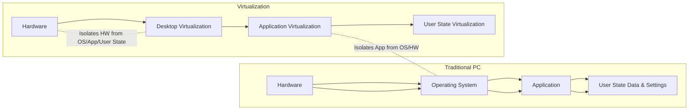

# 📚 Cloud & Big Data Exam Notes: Virtualized Data Center – Desktop & Application (Lazy Edition)

> [!NOTE] This module is about ditching traditional PCs and installed software. Think "apps as a service" and "your desktop anywhere."

---

## ☁️ Module 6: Virtualized Data Center – Desktop and Application

### 🎯 What You Need to Know
*   How to make desktops virtual.
*   How to make applications virtual.
*   Why bother? (Benefits and drawbacks).

### 🔄 Overview: Breaking Dependencies
*   Traditionally: Your PC has its hardware, OS, applications, and your files/settings (user state) all tied together. If one breaks, everything can.
*   **Virtualization's Goal**: Untie these layers!

*(Think of it: Desktop virtualization unties the OS/apps/user data from the hardware. Application virtualization unties the app from the OS.)*

---

## 🖥️ Lesson 1: Desktop Virtualization

### 📉 Drivers (Why do companies do it?)
*   **Manageability**: Too many different PC models, constant hardware upgrades, compatibility nightmares. Virtualizing makes it uniform.
*   **Security**: Laptops/desktops get lost or stolen, data leaks! Centralizing desktops makes data stay in the data center.
*   **Cost**: Buying, maintaining, supporting individual PCs is expensive.

    *(The slide image shows "Manageability," "Security," and "Costs" as the top reasons.)*

### 💡 What is Desktop Virtualization?
*   **Simply**: Detaching the user's desktop environment (user state, OS, applications) from the physical device they are using.
*   **How**: Desktops run as Virtual Machines (VMs) in the data center (VDC).
*   **Access**: Users connect from anywhere (LAN/WAN) using various endpoint devices (PCs, laptops, thin clients).

    ![[Pasted image 20240722143924.png]]
    *(Users (PCs/Thin Clients) connect to "Desktop VMs" hosted centrally.)*

### 💪 Benefits of Desktop Virtualization
*   **Thin Clients**: Can use cheap, simple devices as endpoints.
*   **Improved Security**: Data stays in the data center, not on endpoint devices.
*   **Simplified Data Backup**: Backup all desktops centrally, not individually.
*   **Simplified PC Maintenance**: Manage VMs centrally instead of physical PCs.
*   **Flexibility of Access**: Access your desktop from *any* device, *anywhere*.

### 🛠️ Desktop Virtualization Techniques

1.  **Remote Desktop Services (RDS)**:
    *   **Old name**: Terminal Services.
    *   **How it works**: A single Windows server runs multiple *individual user sessions* on top of one OS installation. Users get a visual stream of their desktop.
    *   **Resource Consumption**: All processing happens on the *server*.
    *   ![[Pasted image 20240722144018.png]]
    *   **Benefits of RDS**:
        *   **Rapid Application Delivery**: Apps installed once on server, accessible by many.
        *   **Improved Security**: Data stored centrally.
        *   **Centralized Management**.
        *   **Low Cost**: More users per server compared to VDI.

2.  **Virtual Desktop Infrastructure (VDI)**:
    *   **How it works**: Each user gets their **own dedicated VM** (with its own OS and applications) hosted on servers in the VDC. Users have full control over their virtual desktop.
    *   ![[Pasted image 20240722144038.png]]
    *   **Components of VDI**:
        *   **Endpoint Devices**: What the user uses (PC, laptop, thin client, smartphone).
        *   **VM Hosting/Execution Servers**: The physical servers running all the individual desktop VMs. Often VMs are created from templates/images.
        *   **Connection Broker**: The "traffic cop" that connects the user's endpoint device to their assigned desktop VM.

        ![[Pasted image 20240722144102.png]]
        *(Endpoints connect to the Broker, Broker connects to VM Hosting Servers, which get storage from Shared Storage.)*

    *   **VDI Benefits**:
        *   Centralized deployment and management.
        *   Improved security (data stays in data center).
        *   Improved Business Continuity and Disaster Recovery (VMs can be moved, replicated easily).
    *   **VDI Considerations (Limitations)**:
        *   **Reliance on Network**: If the network goes down, users can't access their desktops.
        *   **Unsuitable for High-End Graphics**: Latency and bandwidth can be an issue for CAD, video editing etc. (though improving).
        *   **Requires Additional Infrastructure**: Needs robust servers, storage, and networking. Can be expensive upfront.

### 💾 User State Virtualization (USV)
*   **What**: Separating user data, application settings, and OS config from the desktop itself, and storing it centrally.
*   **Why**: An "enabling technology" for desktop virtualization.
*   **Benefits**:
    *   **Easier Migration**: When upgrading OS or refreshing desktops, user data/settings move easily.
    *   **Data Anywhere**: Users can access their personalized environment from *any* endpoint device.

    ![[Pasted image 20240722144129.png]]
    *(User PC's "Local User State" is copied and stored as "Central User State" on a server.)*

---

## 📦 Lesson 2: Application Virtualization

### 💡 What is Application Virtualization?
*   **Simply**: Presenting an application to an end user *without actually installing it* on their device or making it dependent on the underlying OS.
*   **How**: The app runs in an "isolated environment" or "virtualized container."
*   **Benefits**:
    *   Aggregates OS resources with the app (in the container).
    *   Ensures OS and app integrity.
    *   **Avoids Conflicts**: Different apps or different versions of the *same* app can run side-by-side without clashing! (Big deal for IT).

### 🚀 Deployment Methods

1.  **Application Encapsulation**:
    *   The application is packaged into a **self-contained package**.
    *   It **doesn't rely on installation** or the underlying OS.
    *   Can run directly from USB drives, CD-ROMs, or network shares.
    *   The package includes "built-in agents" to make it work.

2.  **Application Streaming**:
    *   Application data/resources are **transmitted to the client *as needed* (on demand)**.
    *   Only a minimum amount of data (10-30%) is sent to launch the app.
    *   Additional features stream down when used.
    *   Requires a "locally installed agent" on the client to run the virtualized app.

### 💪 Benefits of Application Virtualization
*   **Simplified Deployment/Retirement**: Apps aren't installed, so deployment and removal are easy.
*   **Simplified OS Image Management**: Apps are separate from the OS, so OS patches/upgrades don't break apps.
*   **Elimination of Resource Conflicts**: Apps have their own virtual OS resources, so no more DLL hell or version conflicts.

---

### 🌐 Concepts in Practice (Examples)

*   **VMware ThinApp (Application Virtualization)**:
    *   Packages an application, its virtual OS, file system, and registry into a **single .EXE file** (or similar package).
    *   Allows apps to run directly from USB, network share, etc., without installation.
    *   Can run 32-bit apps on 64-bit OSs.

    ![[Pasted image 20240722144211.png]]

*   **VMware View (Desktop Virtualization - VDI)**:
    *   **VMware View Manager**: Centralizes management and brokers connections to desktop VMs.
    *   **VMware View Composer**: Optimizes storage (e.g., linked clones) and simplifies desktop management by using a single "Parent Image" for many desktop VMs.

    ![[Pasted image 20240722144229.png]]

