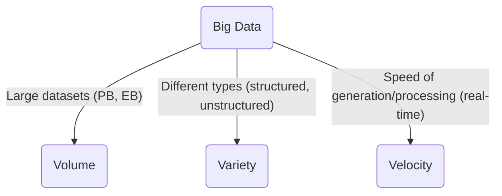

# Big Data & Cloud Computing: Exam Prep for CS Students

This summary distills the key concepts of Cloud Computing and Big Data, focusing on Big Data Analytics, to help you ace your exam. Keep it simple, focused on definitions, characteristics, and practical applications.

## Part 1: Cloud Computing Basics

Cloud Computing is the on-demand delivery of computing services—servers, storage, databases, networking, software, analytics, and intelligence—over the Internet ('the cloud').


### NIST's 5 Essential Characteristics of Cloud Computing:

1. **On-demand self-service:** Consumers can provision computing capabilities (e.g., server time, network storage) automatically without human interaction with each service provider.
2. **Broad network access:** Capabilities are available over the network and accessed through standard mechanisms that promote use by heterogeneous thin or thick client platforms (e.g., mobile phones, laptops, and workstations).
3. **Resource pooling:** The provider’s computing resources are pooled to serve multiple consumers using a multi-tenant model, with different physical and virtual resources dynamically assigned and reassigned according to consumer demand.
4. **Rapid elasticity:** Capabilities can be elastically provisioned and released, in some cases automatically, to scale rapidly outward and inward commensurate with demand.
5. **Measured service:** Cloud systems automatically control and optimize resource use by leveraging a metering capability at some level of abstraction appropriate to the type of service (e.g., storage, processing, bandwidth, and active user accounts).

## Part 2: What is Big Data?

Big Data refers to datasets so large and complex that traditional data processing applications are inadequate to deal with them. It’s not just about size, but also the **variety** and **velocity** of data.

### Sources of Big Data:

- Statistics (sensor data)
- Marketing data
- Mobile applications
- IoT (Internet of Things) devices
- Social Media (user generated content, interactions)
- RDBMS, Images, Videos, Songs, XML
- Web logs, Clickstream data, Payment records

### The 3 V's of Big Data (Key Concept!):

1. **Volume:** The sheer amount of data. This is what 'Big' refers to. We're talking Terabytes, Petabytes, Exabytes, Zettabytes (e.g., 0.8 ZB in 2009 -> 35 ZB in 2020). Think of all transactions and sensor data generated daily.
2. **Variety:** The different types of data, both structured and unstructured. Data comes in many formats: traditional relational databases, images, videos, audio, text documents, XML, web clickstream, social media posts, etc.
3. **Velocity:** The speed at which data is generated, collected, and processed. This can be real-time streams (like stock market feeds, sensor readings), periodic batches, or event-driven data.




### Big Data Challenges:

Due to its scale and complexity, Big Data poses challenges in:

- **Capture:** How to get all this data.
- **Storage:** Where to put it all efficiently.
- **Search:** Finding relevant information quickly.
- **Sharing:** Distributing data for collaboration.
- **Transfer:** Moving massive datasets.
- **Analysis:** Making sense of it all.
- **Visualization:** Presenting insights clearly.

### Why the Trend to Big Data?

The main driver is the ability to extract **additional, valuable information** by analyzing large, related datasets. This allows finding **correlations** that were previously impossible. Examples:

- Preventing diseases
- Spotting business trends
- Determining real-time traffic conditions
- Assessing research quality
- Linking legal citations

This requires **advanced analytics** and new skilled professionals ('market players').

## Part 3: Big Data Type Structures (Complexity)

The 'Variety' of Big Data can be broken down into different structures, each requiring different tools and techniques for processing and analysis:

### Types of Data Structure:

- **Structured Data:** Highly organized, typically in tables with predefined schema. Think relational databases (RDBMS), transaction data, or OLAP cubes.
  - *Example:* Customer names, order IDs, prices in a sales database.
- **Semi-Structured Data:** Has some organizational properties but doesn't conform to a strict schema. It often contains tags or markers to separate semantic elements. Parsable.
  - *Example:* XML files, JSON documents, log files, emails.
- **Quasi-Structured Data:** Has erratic data formats that might need significant effort to format, but some patterns can be discerned. Often found in textual data.
  - *Example:* Web clickstream data with inconsistencies, free-form text from surveys.
- **Unstructured Data:** Has no predefined data model or organization. It's often human-generated and contains varied information that doesn't fit neatly into traditional databases.
  - *Example:* Text documents (Word, PDF), images, audio files, videos, social media posts.

```
Structured
-----
Semi-Structured
-----
Quasi-Structured
-----
Unstructured
```

## Part 4: Big Data Analytics - Drivers and Approaches

### Business Drivers for Analytics:

Organizations use analytics to address key business problems and gain a competitive edge:

- **1. Optimize Business Operations:** Improve sales, pricing, profit, efficiency (e.g., Sales forecasting, inventory management).
- **2. Identify Business Risks:** Detect and mitigate risks like customer churn or fraud (e.g., Credit risk assessment, fraud detection).
- **3. Predict New Business Opportunities:** Uncover potential for growth, upsell, cross-sell, or finding new customer segments (e.g., Product recommendations, market segmentation).
- **4. Comply with Regulations:** Ensure adherence to legal and regulatory requirements (e.g., Anti-Money Laundering (AML), Fair Lending laws).

### Business Intelligence (BI) vs. Data Science (Predictive Analytics & Data Mining):

These terms are often used interchangeably, but they represent different levels of analytical depth:

| Feature | Business Intelligence (BI) | Data Science (Predictive Analytics & Data Mining) |
|---------|----------------------------|--------------------------------------------------|
| Common Question | What happened? (Descriptive) | What will happen? What if? (Predictive/Prescriptive) |
| Goal | Standard reporting, dashboards, alerts, queries | Optimization, predictive modeling, forecasting, statistical analysis |
| Data Types | Structured data, traditional sources, manageable data sets | Structured/unstructured data, many types of sources, very large data sets |
| Time Horizon | Past/Present | Future |
| Business Value | Lower | Higher |

### Typical Analytical Architecture Problems & The Need for Change:

Traditional architectures face issues when dealing with Big Data and advanced analytics:

```mermaid
graph LR
    DS[Data Sources (1)] -- Inefficient ETL --> DW[Data Warehouses]
    DS --> DM[Data Marts (2)]
    DM -- Isolated --> BI[Business Intelligence & Reporting (3)]
    DW -- Feeds --> BI
    BI -- Limited Access --> AS[Analytic Silo (4)]
    AS -- Data Extracts & Samples --> OfflineAnalysis[Offline Analyst Tools]

    subgraph Issues
        OfflineAnalysis -- No Feedback --> DW
        DM -- Not Backed Up --> Risk[Data Loss Risk]
        DW -- Slow Schema Changes --> Inflexibility[Limited Iteration]
        AS -- 'Analyst Owned' (Unstandardized) --> NoAlignment[Not Aligned with Corp Goals]
        OfflineAnalysis -- Samples Only --> Skew[Skewed Model Accuracy]
    end

    style DS fill:#A8D1E6,stroke:#333,stroke-width:1px
    style DW fill:#A8D1E6,stroke:#333,stroke-width:1px
    style DM fill:#A8D1E6,stroke:#333,stroke-width:1px
    style BI fill:#D7EAF3,stroke:#333,stroke-width:1px
    style AS fill:#D7EAF3,stroke:#333,stroke-width:1px
    style OfflineAnalysis fill:#F3F8FA,stroke:#333,stroke-width:1px

    linkStyle 0 stroke-dasharray: 5 5;
    linkStyle 1 stroke-dasharray: 5 5;
    linkStyle 2 stroke-dasharray: 5 5;
    linkStyle 3 stroke-dasharray: 5 5;
    linkStyle 4 stroke-dasharray: 5 5;
```

- **Data Silos (Spreadmarts):** Data is isolated and not networked or backed up, limiting comprehensive analysis.
- **Rigid Data Warehouses:** Designed for specific purposes, data ingress/egress is slow, and schema changes are difficult, hindering iterative analytics and exploration of unstructured data.
- **Slow Time-to-Insight:** Predictive analytics often comes last in line for data, and analysts rely on creating data extracts, often just samples, for offline analysis. Results are rarely fed back into the main repository.
- **Reduced Business Impact:** Isolated, unstandardized analytic projects lead to skewed models and a slow 'time-to-insight', reducing business impact.

### The Analytic Sandbox: A Solution

To overcome these challenges, a new approach is needed: the **Analytic Sandbox**.

- **Definition:** A dedicated environment where data assets from multiple sources are gathered and processed using various technologies for analysis.
- **Benefits:** Enables high-performance analytics using in-database processing, reduces data replication costs, and is 'analyst-owned' (giving analysts more control and flexibility).
- **Criteria for Big Data Projects:** Requires focus on speed of decision making, high throughput, and analysis flexibility.

## Part 5: The Role of the Data Scientist & Ecosystem

### Key Roles in the New Data Ecosystem:

- **Deep Analytical Talent (Data Scientist):** People with advanced training in quantitative disciplines (mathematics, statistics, machine learning) who can design and implement complex models.
- **Data Savvy Professionals:** Individuals with a basic knowledge of statistics and machine learning, able to define key questions that can be answered using advanced analytics.
- **Technology & Data Enablers:** Technical experts providing support for analytical projects, including computer programming and database administration.

### Data Scientist Profile:

A Data Scientist needs a diverse skill set beyond just technical ability:

- **Quantitative:** Strong foundation in math, statistics, and machine learning.
- **Technical:** Proficient in programming, data manipulation, and relevant tools.
- **Skeptical:** Able to critically evaluate data, assumptions, and models.
- **Curious & Creative:** Eager to explore data, ask novel questions, and devise new solutions.
- **Communicative & Collaborative:** Capable of explaining complex findings to non-technical stakeholders and working effectively in teams.

### Data Scientist Key Activities:

- Reframe business challenges as analytics challenges.
- Design, implement, and deploy statistical models and data mining techniques on big data.
- Create actionable insights and recommendations from data.

### Big Data Ecosystem Overview:

This complex ecosystem involves various players interacting with data:


- **Data Devices (1):** Generate raw data (e.g., cell phones, sensors, ATMs, video cameras).
- **Data Collectors (2):** Gather data from devices (e.g., government agencies, medical institutions).
- **Data Aggregators (3):** Combine data from multiple sources (e.g., websites, marketing firms).
- **Data Users/Buyers (4):** Utilize aggregated data for various purposes (e.g., media, financial bureaus, private investigators).

## Part 6: Big Data Analytics - Industry Examples

Big Data analytics is transforming numerous industries:

- **1. Healthcare:**
  - **Situation:** Poor police response, medical care issues (shooting incident).
  - **Use of Big Data:** Doctor mapped crime data with medical billing records (3 hospitals).
  - **Outcomes:** Reduced hospital costs by 56% (80% of costs from 13% low-income/elderly residents). Offers preventative care (phone/home visits).

- **2. Public Services:**
  - **Situation:** Exponential increase in global pandemics, antibiotic resistance.
  - **Use of Big Data:** Created viral listening posts, combined viral discovery, disease hotspots, social media trends.
  - **Outcomes:** Accurate predictions on pandemic spread. Identified new malaria form. Understood reasons for swine flu control failures. Proposing proactive outbreak prevention.

- **3. Life Sciences:**
  - **Situation:** Broad Institute (MIT & Harvard) mapping Human Genome.
  - **Use of Big Data:** Mapped 3 billion genetic base pairs (8 petabytes). Developed 30+ public software packages.
  - **Outcomes:** Identified cellular mutations causing diseases. Innovating genomic research for new pharmaceutical drugs.

- **4. IT Infrastructure (Hadoop):**
  - **Situation:** Explosion of unstructured data, need for quick/efficient analysis.
  - **Use of Big Data:** Doug Cutting created Hadoop (divides large tasks into smaller ones across many computers). Analyzes social media data.
  - **Outcomes:** New York Times used Hadoop to transform 11 million PDF files from 1851-1922 archives in 24 hours. Applications: sentiment analysis, natural language processing.

- **5. Online Services (LinkedIn):**
  - **Situation:** Opportunity to create social media for professionals.
  - **Use of Big Data:** Collects/analyzes data from 100+ million users, adding 1 million new users/week.
  - **Outcomes:** LinkedIn Skills, InMaps, Job Recommendations, Recruiting features. Established a diverse data scientist group.

## Conclusion

Good luck with your exam! Remember the key definitions, the '3 V's', the challenges of traditional architectures, and how data science solves these issues with advanced analytics and new roles like the Data Scientist. Knowing the industry examples will help illustrate your understanding.
