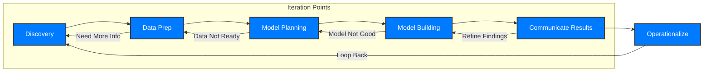

# Module 2: Data Analytics Lifecycle - Exam Cheat Sheet

This module covers the systematic approach to solving data analytics problems. Understanding the Data Analytics Lifecycle is crucial for managing projects effectively, ensuring reliable results, and enabling successful deployment of analytical solutions. It's an iterative process, meaning you can loop back to previous steps as new information emerges.

## 1. Why Use a Data Analytics Lifecycle?

Following a well-defined lifecycle brings several advantages to your analytics projects:

- **Focus Your Time:** Breaks down complex problems into smaller, manageable steps.
- **Comprehensive & Repeatable:** Ensures a structured method for analysis, preventing rushed data collection/analysis without proper planning.
- **Accuracy & Validity:** Documenting the process helps demonstrate the accuracy of your findings and supports their validity.
- **Team Collaboration:** Facilitates smoother transitions and collaboration among cross-functional analytic teams.
- **Scalability:** Allows scaling solutions to additional analysts and broader use.
- **Guidance:** Provides a clear roadmap for end-to-end analytics, from discovery to project completion.

## 2. Key Roles in a Successful Analytics Project

Data analytics projects are multidisciplinary and require various roles:

| Role                              | Description                                                                                                                                                  |
| --------------------------------- | ------------------------------------------------------------------------------------------------------------------------------------------------------------ |
| **Business User**                 | Benefits from results, advises on value, and how results will be used operationally.                                                                         |
| **Project Sponsor**               | Originates the project, provides funding, sets core business problem, measures final outputs.                                                                |
| **Project Manager**               | Ensures milestones and objectives are met on time and with expected quality.                                                                                 |
| **Business Intelligence Analyst** | Deep business domain knowledge, understands data, KPIs, and reporting needs.                                                                                 |
| **Data Engineer**                 | Technical skills for data management, SQL query tuning, data extraction, and populating analytic sandboxes.                                                  |
| **Database Administrator (DBA)**  | Provisions and configures database environments to support analytical needs.                                                                                 |
| **Data Scientist**                | Subject matter expert in analytical techniques, data modeling, applying techniques to business problems, and ensuring overall analytical objectives are met. |

## 3. The Data Analytics Lifecycle Phases (A Must-Know!)

The lifecycle is an iterative, six-phase process:

### Phase 1: Discovery

This is the initial phase where you define the problem, learn the business domain, and form initial hypotheses.

- **Learn the Business Domain:** Understand the context, determine the general analytic problem type (e.g., clustering, classification). Research past attempts and why they failed.
- **Assess Resources:** Evaluate available technology, data, people, and time scope. Identify if more resources are needed.
- **Frame the Problem (Crucial!):** State the analytics problem clearly, identify stakeholders, pain points, and objectives. Define success criteria (what is 'good enough'?), failure criteria, and risks.
- **RACI Matrix:** A tool to clarify roles and responsibilities:
  - **R**esponsible: Who *does* the work.
  - **A**ccountable: Who is *ultimately answerable* (only one A per task).
  - **C**onsulted: Who provides input/expertise (domain experts).
  - **I**nformed: Who needs to be updated after decisions/actions.
- **Formulate Initial Hypotheses (IH):** Develop preliminary ideas about what might be causing the problem or what relationships exist. Gather these from stakeholders and domain experts. Conduct preliminary data exploration to inform discussions.
- **Identify Data Sources:** Begin learning about the data by aggregating sources, reviewing raw data, and determining structures and tools needed. Scope the kind of data required for the problem.

**Deliverable:** Analytic Plan

### Phase 2: Data Preparation

This phase involves preparing the data for analysis. It's often the most time-consuming part.

- **Prepare Analytic Sandbox:** Create a dedicated workspace for the analytic team, often large (10x EDW size), where you can explore data without interfering with live production databases. Collect *all kinds* of data (summary, structured, raw feeds, unstructured text, web logs).
- **ELT (Extract, Load, Transform) vs. ETL (Extract, Transform, Load):**
  - **ETL:** Data is extracted, *transformed*, then loaded into a database. Transformations occur *before* loading.
  - **ELT:** Data is extracted, *loaded raw* into the database (or analytic sandbox), then *transformed* by analysts as needed. This approach preserves raw data, allowing flexibility and multiple transformations without re-extracting.
- **Key Data Preparation Activities (ELT approach):**
  - Determine needed transformations.
  - Assess data quality and structuring.
  - Derive statistically useful measures.
  - Extract data and determine data connections for raw data, OLTP, OLAP cubes, or data feeds.
- **OLTP (Online Transaction Processing) vs. OLAP (Online Analytical Processing):**
  - **OLTP:** Focuses on current data, large number of short, online transactions (INSERT, UPDATE, DELETE). Emphasis on fast query processing and data integrity. Used for operational systems.
  - **OLAP:** Deals with historical or archival data. Relatively low volume of transactions, often complex queries involving aggregations. Used for data analysis and reporting (like data warehouses).
- **Data Familiarization & Conditioning:**
  - List data sources, identify what's needed vs. available.
  - Clean and normalize data, distinguish what to keep/discard.
  - Assess data consistency, check for missing/inconsistent values, systematic errors, and data definition uniformity across measurements.
  - Review data distribution, granularity, range of values, and aggregation levels. Ensure data is standardized/normalized.
- **Survey & Visualize:** Get an overview of the data, zoom/filter, examine details-on-demand. Use descriptive statistics and check data quality.
- **Useful Tools:** SQL, Hadoop, MapReduce, Alpine Miner, R (for visualization and descriptive statistics like ggplot, lattice), GnuPlot, Spotfire, Tableau.

**Deliverable:** Clean, Prepared Data

### Phase 3: Model Planning

Here, you select methods and techniques for building the analytical model.

- **Determine Methods:** Choose methods based on hypotheses, data structure, and volume. Ensure techniques align with business objectives.
- **Refer Back to Hypotheses:** This phase reconnects with the hypotheses and understanding of the business problem established in Phase 1.
- **Consider Data Structure:** The data structure (textual vs. transactional) dictates the tools and techniques.
- **Data Exploration:** Understand relationships among variables.
- **Variable Selection:** Identify inputs from stakeholders, capture essence of predictors (e.g., using dimensionality reduction), perform iterative testing for significant variables.
- **Model Selection:** Choose techniques based on the end goal (e.g., churn prediction uses logistic regression, decision trees, neural networks). Convert to SQL or database language for best performance.
- **Techniques & Workflow:** Candidate tests and sequence for modeling assumptions. Document all assumptions.
- **Useful Tools:** R, PostgreSQL, SQL Analytics, Alpine Miner, SAS/ACCESS, SPSS/ODBC.

**Deliverable:** Model Plan / Design

### Phase 4: Model Building

This is where you execute the model plan, develop the actual model, and evaluate its performance against the business objectives.

- Develop the analytical model using chosen algorithms (e.g., regression, classification, clustering).
- Train and test the model using prepared data.
- Refine the model for accuracy and robustness.

**Deliverable:** Robust Model

### Phase 5: Communicate Results

Presenting the findings to stakeholders is key for actionability.

- Present model results and insights in a clear, concise manner.
- Explain the business implications of the findings.
- Develop recommendations based on the analysis.

**Deliverable:** Findings Report / Presentation

### Phase 6: Operationalize

Integrating the analytical solution into the business operations.

- Deploy the model into production systems.
- Monitor its performance over time.
- Establish processes for ongoing maintenance and improvement.

**Deliverable:** Operationalized Solution / Deployed Model

## 4. Case Study: ABC Retail Bank (Applying the Lifecycle)

ABC Retail Bank aims to improve Net Present Value (NPV) and Retention Rate (RR) of customers, specifically reducing Churn Rate (CR) by at least 5%. They also want to understand reasons for customer churn.

### Discovery Phase in Practice:

- **Business Problem:** Reduce Churn Rate, improve NPV/RR. (What's CR: annual percentage of customers leaving a service/job).
- **Hypotheses (IH):** Initial thoughts on why customers churn, what influences NPV/RR.
- **Data Needs:** Customer data (250K for pilot, 2.5M for final), Customer Profile (salary, age, years as customer), Service Indicators (accounts: credit card, mortgage, savings, checking), Customer transactions (size, count for credit/debit).
- **Dependencies:** Data consistency over time (5 months historical data for churn prediction).

### Data Preparation in Practice:

- **Analytic Sandbox:** A space for the bank's analytics team to explore customer data without impacting live production systems.
- **ELT approach:** Load raw customer transaction and profile data directly into the sandbox (e.g., using EDW, OLTP systems).
- **Data Cleansing:** Check consistency of income levels (positive?), consistency of data definitions (e.g., 'customer' means the same across all data), check for missing values or systematic errors in data feeds.
- **Granularity Check:** Are time-related variables (daily, weekly, monthly) sufficient? Is 'age' data for marketing representative (e.g., 'having a family' age group vs. seniors/teenagers in training data)?
- **Relevant Data:** For churn prediction, the most relevant time period for transactional decline needs to be determined (e.g., 5 months).

### Model Planning in Practice (Churn Prediction Example):

- **Methods:** Research suggests methods like Logistic Regression, Decision Trees, Neural Networks, Multiple Linear Regression (MLR) are used for churn prediction in various sectors (Wireless Telecom, Retail Business, Daily Grocery).
- **Risk:** Project fails if valid predictors of churn cannot be determined.
- **Data for Model:** Use 24 months for training, then analyze 5 months of historical data for churned customers (as determined by declining transactions).

## 5. Key Takeaways for Your Exam

Remember these points:

- **The 6 Phases of the Lifecycle:** Discovery, Data Prep, Model Planning, Model Building, Communicate Results, Operationalize. Know their order and purpose.
- **Iteration:** Analytics is rarely linear; be ready to loop back.
- **RACI:** Understand its purpose for roles/responsibilities.
- **ELT vs. ETL:** Know the difference and why ELT is preferred in analytics (raw data preservation).
- **OLTP vs. OLAP:** Distinguish between operational and analytical systems.
- **Hadoop/MapReduce:** Key tools for distributed processing and storage of big data, especially for unstructured data.
- **Data Scientist's Role:** More than just coding; includes problem framing, communication, and domain knowledge.

## Conclusion

Mastering the Data Analytics Lifecycle will enable you to structure any analytics project effectively, from understanding the business problem to deploying a solution. Good luck with your exam!
