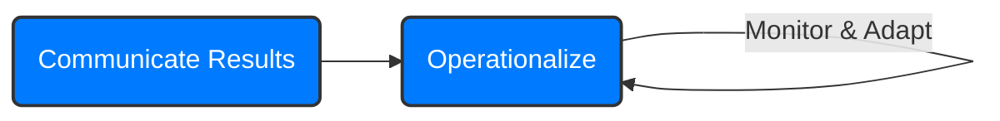

Here is the Obsidian Markdown version of the provided JSON:
# Module 2: Data Analytics Lifecycle - Exam Cheat Sheet (Phases 4, 5, 6)

This summary continues our dive into the Data Analytics Lifecycle, covering Model Building, Communication, and Operationalization. These are crucial steps for turning data insights into real-world value.

## Part 1: Phase 4: Model Building

This is where the actual analytical model is developed, trained, and tested. It's often highly iterative with Phase 3 (Model Planning).

### Key Activities & Considerations:

- **Develop Data Sets:** Create sufficiently robust data sets for training, testing, and ultimately, production. Use smaller test sets for validating approaches and initial experiments.
- **Optimal Environment:** Ensure you have the best environment for building models, typically one with fast hardware and parallel processing (like an analytic sandbox).
- **Model Fitting & Evaluation:** Fit the model on the *training data* and evaluate its performance (score it) against the *test data*. This work happens in the sandbox, not live production.
- **Iteration:** Model Planning and Model Building phases often overlap significantly. You'll iterate back and forth until a robust model is settled.
- **Supervised vs. Unsupervised Learning:** Be aware if your chosen method requires a labeled *training data set* (supervised, e.g., classification) or not (unsupervised, e.g., clustering).
- **Complexity vs. Duration:** Modeling techniques can be complex, but the *duration* of this phase can be surprisingly short compared to data preparation. More time should be spent on data preparation (Phases 1-2) and communicating findings (Phase 5).
- **Key Steps in Model Building (Execution):**
  1. **Execute Models:** Run the models defined in Phase 3.
  2. **In-Database Conversion:** If possible, convert models (e.g., R models) to SQL or similar database language to run them as in-database functions for significantly faster processing on large datasets (PL/R for PostgreSQL is an example).
  3. **File Extracts for Testing:** Use R or SAS models on file extracts for testing and smaller datasets.
  4. **Assess Validity:** Evaluate if the model accounts for most of the data and has robust predictive power (e.g., does it have high accuracy, good AUC?).
  5. **Fine-Tune:** Optimize results by modifying variable inputs or model parameters.
  6. **Record:** Document results and the model's logic for future reference.

### Model Iteration & Refinement Questions:

- Is the model **valid and accurate** on the test data?
- Does the model output/behavior **make sense to domain experts**? Are the 'answers' reasonable in context?
- Is the model **accurate enough** to meet project goals?
- Is it avoiding critical mistakes (e.g., the severity of **false positives vs. false negatives** depends on the context)?
- Do **parameter values** of the fitted model make sense within the domain?
- Do you need **more data or inputs**? Do you need to **transform or eliminate** any inputs?
- Do you need a **different form of model**? (If yes, go back to Model Planning).

### Useful Tools for Phase 4:

- **Statistical Programming:** R, SAS (including Enterprise Miner), PL/R (for PostgreSQL integration).
- **Database/Processing:** SQL, Alpine Miner.

## Part 2: Phase 5: Communicate Results

This phase focuses on interpreting the model's findings and effectively communicating them to stakeholders. It answers: 'Did we succeed? Did we fail?'

### Key Activities:

- **Interpret Results:** Explain what the model found.
- **Compare to Hypotheses:** See if the findings align with (or disprove) the initial hypotheses from Phase 1.
- **Identify Key Findings:** Distill the most important insights.
- **Quantify Business Value:** Translate findings into measurable business impact (e.g., cost savings, revenue increase).
- **Summarize for Audience:** Tailor the presentation of findings based on the audience (e.g., executives need the 'big picture,' analysts need technical details).

### ABC Bank Case Study - Possible Results & Key Findings:

- **Churn Predictors:** Transaction volume and type (e.g., stopping gas/groceries, debit card use < 5 times/month) are strong indicators of churn.
- **Specific Rules:** Customers using debit cards less than 5 times/month will churn within 60 days.
- **Business Impact:** By targeting high-risk customers, attrition could be reduced by 25%, saving $3M in lost revenue and avoiding $1.5M in new customer acquisition costs annually.

## Part 3: Phase 6: Operationalize

The final phase involves deploying the model into a production environment and continuously monitoring and improving it. This is the first time the analytical methods are deployed in a live setting.

### Key Activities & Considerations:

- **Pilot Deployment:** Recommended approach is a small-scope pilot deployment first to limit risk and learn about performance/constraints before a full enterprise launch.
- **Assess Benefits:** Evaluate the real-world impact and benefits in a live setting.
- **Deliverables:** Deliver final code and documentation.
- **Production Execution:** Integrate the model execution into the production environment.
- **Update & Retrain Process:** Define a clear process for updating and retraining the model as needed. This is crucial for long-term accuracy.
- **New Team Members:** This phase often brings in production engineers responsible for the deployment environment, who have their own issues and concerns.
- **Smooth Integration:** Ensure the model runs smoothly and integrates seamlessly with downstream processes.
- **Follow-Up & Reevaluation:** Conduct follow-up assessments to reevaluate the model's performance in production over time.
- **Performance Monitoring:** Assess if the model is meeting goals (e.g., revenue increase, churn reduction). If outcomes aren't occurring, investigate if it's due to model inaccuracy or if predictions aren't being acted on.
- **Automate Retraining:** If accuracy degrades or inputs operate 'out-of-bounds' (inputs far beyond what the model was trained on), automate retraining the model. Design alerts for 'out-of-bounds' operation.
- **New Insights:** Operationalizing often yields new insights about the business or previously 'impossible' ideas.

## Part 4: 4 Core Deliverables & Analyst Wish List

### 4 Core Deliverables (for most stakeholder needs):

- **1. Presentation for Project Sponsors:** 'Big picture' takeaways, key messages for decision-making, clean visuals.
- **2. Presentation for Analysts:** Business process changes, reporting changes, technical details (ROC curves, density plots, histograms) for fellow data scientists.
- **3. Code:** The analytical code for technical implementation.
- **4. Technical Specs:** Documentation for implementing the code.

### Key Outputs from Analytic Project, by Role (Deep Dive into Deliverables):

| Role | What They Need in Final Deliverables |
|------|--------------------------------------|
| **Business User** | Sponsor Presentation (Is it good for me? What are benefits/implications?) |
| **Project Sponsor** | Sponsor Presentation (Business impact, risks, ROI, how to evangelize?) |
| **Project Manager** | Ensures milestones met (implies visibility into progress and final outcomes) |
| **Business Intelligence Analyst** | Analyst presentation, understanding how reports will change |
| **Data Engineer** | Code, technical document on implementation |
| **Database Administrator (DBA)** | Code, technical document on implementation |
| **Data Scientist** | Analyst presentation, code (for self-documentation and peer review) |

### Analyst Wish List (What makes a project successful for analysts?):

- **Data & Workspaces:** Access to all data (OLAP, BI tools, raw, structured, unstructured), up-to-date data dictionary, staging/production data sets, ability to move data between workspaces, powerful analytic sandbox for experimentation.
- **Tools:** Choice of statistical/mathematical/visual software (SAS, Matlab, R, Java, Tableau, Spotfire), online collaboration platforms, error logging tools for systems/environments.

## Part 5: Greenplum's Approach to Analytics (Concepts in Practice)

This illustrates a practical approach to Big Data analytics, embodying the principles of the lifecycle:

- **Magnetic:** Attracts and integrates all kinds of data (raw, structured, unstructured).
- **Agile:** Features flexible and elastic data structures, adapting to changing needs and data types.
- **Deep:** Utilizes a rich data repository and powerful algorithmic engine for advanced analysis.
- **Flow:** Data flows from being collected/loaded into the cloud, analyzed/modeled, and then results are pushed back for use. It supports both descriptive (What happened?) and predictive (What will happen?) analytics.

## Conclusion

The Data Analytics Lifecycle is your blueprint for navigating data projects. By understanding each phase, the roles involved, and the necessary deliverables, you're well-equipped to tackle exam questions and real-world challenges. Remember to focus on the iterative nature, the importance of data quality, and the strategic value of operationalized models. Good luck!
