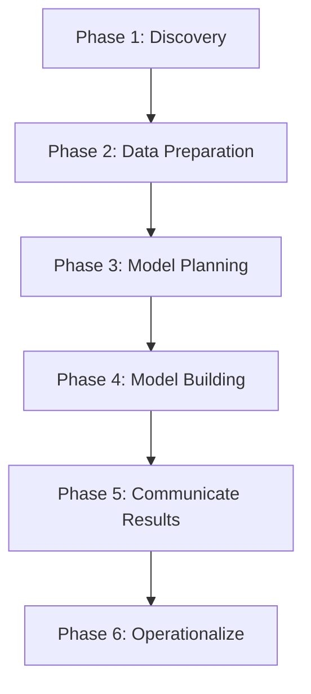
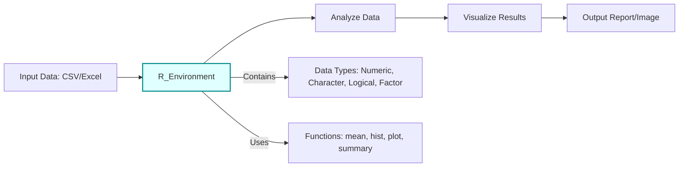
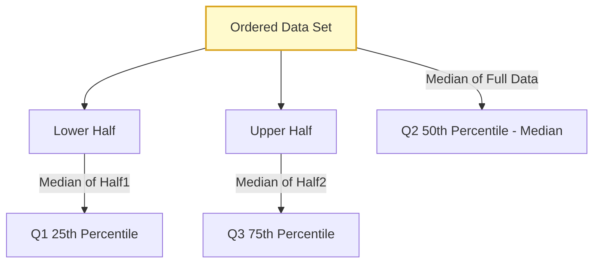
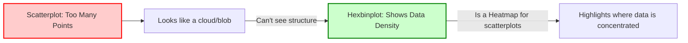
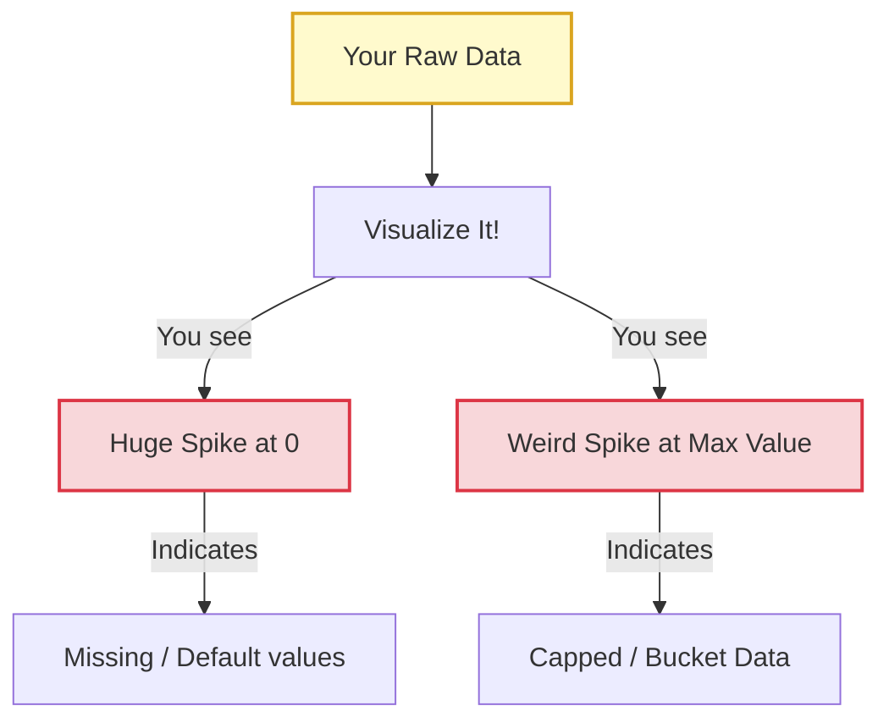

---
tags:
  - CS_Exam_Prep
  - Lazy_Explanations
  - Data_Analytics
  - R_Basics
  - Visualization
---

# 😴 Lazy Data Analytics for Your Exam Tomorrow 😴

Alright, deep breaths. You've got this. Or at least, you'll pretend you do. This is the **super stripped-down version** of everything you might need to *kinda* know for that exam. We're talking highlights, not deep dives.

Remember, the course is **Cloud Computing & Big Data**, so this "Data Analytics" part is probably about understanding the *data itself* and *how to approach it*, not building complex algorithms from scratch.

---

## 🎯 The Big Picture (Objectives)

### The Gist (Too Lazy; Didn't Read)
It's about **poking at data to see what's up, using R to do it, and figuring out what your data is trying to tell you (or not tell you).**

### Key "Concepts"
-   **Analyze Data:** Use stuff like averages, spreads, and relationships (like distributions, tests, summaries) to understand your data.
-   **Use R:** It's your calculator and drawing board for data. Get data in, mess with it, make pretty pictures, report.
-   **Hypotheses:** Before you test anything, guess what you think is happening (alternative) and what you're trying to prove wrong (null). Like, "My new code is faster!" (alternative) vs. "My new code is no different from the old one." (null).

### Pro Tip (for tomorrow)
Think of it as: **"What's in the data? How do I look at it with R? And what questions am I even trying to answer?"**

---

## 🔁 Data Analytics Lifecycle

### The Gist (Too Lazy; Didn't Read)
It's just the **step-by-step cookbook for doing data stuff.** Don't jump straight to cooking; you need to plan your meal first.

### Key "Phases" (in order)
1.  **Discovery:** What's the problem? What data do I have? (Like finding out what's in your fridge.)
2.  **Data Preparation:** Clean it up, get it ready. (Chopping veggies, washing dishes.)
3.  **Model Planning:** What kind of analysis/recipe do I need? (Deciding if it's soup or a stir-fry.)
4.  **Model Building:** Do the analysis! (Actual cooking.)
5.  **Communicate Results:** Tell people what you found. (Serving the meal.)
6.  **Operationalize:** Make it a regular thing. (Turning your meal into a weekly special.)

### Visual "Help"


### Pro Tip (for tomorrow)
You need a **tool (R)** and **stats skills**. Don't just start coding; think about the problem first.

---

## 🖥️ Introduction to R (The Tool)

### The Gist (Too Lazy; Didn't Read)
**R is like a fancy spreadsheet that's also a powerful calculator and a great artist.** It helps you do all the data analysis things mentioned above.

### Key "Stuff" You Do in R
-   **GUI:** Yes, it has a point-and-click interface, but real pros (or at least people who want to look like pros) use code.
-   **Data In/Out:** Get data from files, save your results. Basic input/output.
-   **Data Types:** Numbers (integers, decimals), text (characters), true/false (logical), categories (factors). R loves its `vector` (list of same type stuff) and `data.frame` (like a table/spreadsheet).
-   **Basic Operations:** Math (`+ - * /`), comparisons (`== > <`), applying functions to data.
-   **Statistics:** Calculating means, medians, standard deviations, etc.
-   **Generic Functions:** Commands that just *do things* to your data, like `summary()` to get a quick overview.

### Visual "Help" (Conceptual R)



```R
# Super lazy R pseudo-code:
my_data <- read.csv("your_boring_data.csv") # Get data in
summary(my_data$column_name) # Quick stats on a column
hist(my_data$numeric_column) # Make a bar chart of numbers
```

### Pro Tip (for tomorrow)
R is essential. Know it takes different types of data and can spit out quick summaries and plots.

---

## 📊 Analyzing & Exploring Data (Stats & Visualization)

### The Gist (Too Lazy; Didn't Read)
**Numbers alone lie. Seriously, they do. Always look at the pictures.** And know your basic descriptive stats.

### Key "Statistical" Concepts
-   **Mean:** The average. Add them all up, divide by how many. (Sensitive to weird outliers).
-   **Median:** The *middle* number when data is sorted. (More robust to weird outliers).
-   **Standard Deviation:** How "spread out" your data is from the mean. Big SD = wild data. Small SD = tight data.
-   **Quartiles (Q1, Q2, Q3):**
    -   **Q2 (Median):** Cuts data in half (50th percentile).
    -   **Q1:** Median of the *bottom* half (25th percentile).
    -   **Q3:** Median of the *top* half (75th percentile).
    -   They split your data into four equal groups.

### Visual "Help" (Quartiles)


### Why Visualize? (Anscombe's Quartet)
-   **THE MOST IMPORTANT TAKEAWAY:** Datasets can have *identical* statistical summaries (mean, variance, correlation, regression line) but be **wildly different** when plotted.
-   **The Moral:** If you don't plot your data, you're flying blind and *will* make bad assumptions. Numbers don't tell the full story.
-   **Visual Example Concept:** Imagine four scatter plots. Each one would look unique, but if you calculated their basic stats, they'd all be the same! This is the classic "Anscombe's Quartet" example. (Search it if you want to see the specific plots).

### Pro Tip (for tomorrow)
**"Visualize before analyzing!"** If your data looks weird, it probably *is* weird.

---

## 🖼️ Types of Visualizations & What to Look For

### The Gist (Too Lazy; Didn't Read)
Different charts for different questions. They help you find **patterns, trends, and problems.**

### What to Look For (and the Charts to Use)
-   **Single Variable Distribution:** How often does each value appear?
    -   **Charts:** Histograms (bars showing frequency), Density plots ("smoothed" histograms).
    -   **What to see:** Is it symmetric? Skewed (tail to left/right)? Uni-modal (one peak) or Bi-modal (two peaks)? Outliers?
-   **Single Variable Over Time:** How does something change over dates/times?
    -   **Chart:** Time series plot (line graph).
    -   **What to see:** Trends (going up/down overall), Seasonality (repeating patterns, e.g., sales peak every Christmas).
-   **Relationship Between Two Variables:** How does one thing change when another does?
    -   **Chart:** Scatterplots (points for each pair of values).
    -   **What to see:** Linear? Curved? No relationship? Clusters?
    -   **High Volume Data:** Regular scatterplots get messy. Use a **Hexbinplot** – it's like a heatmap over a scatterplot, showing *where points are concentrated* by shading hexagonal bins.

### Visual "Help" (High Volume Scatter vs Hexbin Concept)


### Pro Tip (for tomorrow)
Histograms/Density for single variable shape. Time series for trends. Scatterplots for relationships. Hexbin for scatterplots with too much data.

---

## 🧹 Dirty & Saturated Data

### The Gist (Too Lazy; Didn't Read)
**Data is almost never clean. Always assume it's messy and try to find the gross parts.**

### Key "Problems"
-   **Dirty Data:** Wrong values, missing values, typos.
    -   **Example (from slides):** Age distribution with a huge spike at 0 (missing values?) or 100+ (data entry error, or inherited accounts coded weirdly?). Visualizing reveals these problems quickly.
    -   **What to look for:** Unexpected spikes/gaps, values outside normal range.
-   **Saturated Data:** Data that's capped or has a "placeholder" value that *looks* like real data.
    -   **Example (from slides):** Mortgage age data where a huge chunk is exactly "10 years old." This could mean "10 years *or older*" (e.g., all loans originated before 2001 were just labeled "2001").
    -   **Impact:** If you analyze "10 years," it doesn't mean what you think it means. It's a special category, not a literal age.
-   **The Solution:** Recognize these issues through visualization. Then, either:
    -   Ignore the dirty/saturated data if it won't impact your analysis.
    -   Clean it (fill missing values, correct errors).
    -   Find better data sources.

### Visual "Help" (Dirty Data Concept)


### Pro Tip (for tomorrow)
If you see huge unexpected piles of data at minimum or maximum values (like age 0 or age 100, or a specific year like "2001"), that's **RED FLAG** for dirty or saturated data. Don't trust it without questioning.

---

### 👋 That's the super-speed run. Good luck with the exam. May your brain retrieve cached data efficiently!