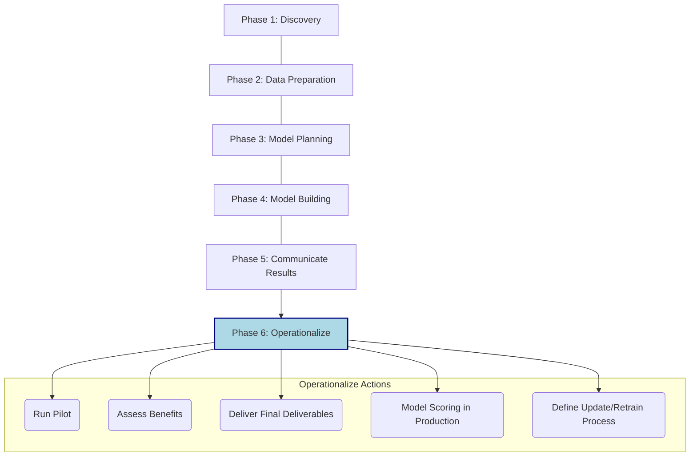
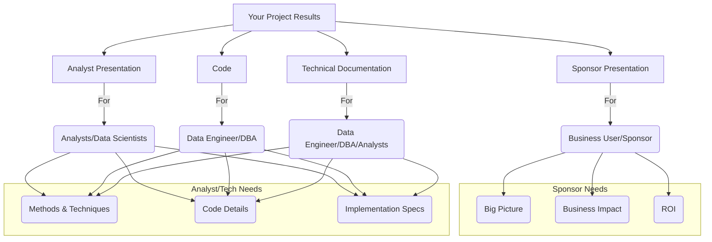

---
tags:
  - CS_Exam_Prep
  - Lazy_Explanations
  - Data_Analytics
  - Project_Deliverables
  - Communication
---

# 😴 Module 6: Putting It All Together (Lazily Explained) 😴

Alright, last push. This module is basically: "You did the data science stuff, now what? How do you tell people what you found without them falling asleep, and how do you make it actually *work*?"

It's all about the **finish line, the show-and-tell, and making sure your cool analysis isn't just a one-off spreadsheet.**

---

## 🏁 Data Analytics Lifecycle: The End Game (Operationalize)

### The Gist (Too Lazy; Didn't Read)
You're done *analyzing*, now make your work useful and repeatable. **Don't just build it, *implement* it and *tell people* about it.**

### Key "Concepts" (Phase 6: Operationalize)
-   **Run a pilot:** Test your awesome model in a small, real-world scenario first. Don't unleash it on everyone immediately.
-   **Assess benefits:** Did it actually help? Quantify the win (e.g., "saved $X" or "improved Y by Z%").
-   **Deliverables:** Give the necessary reports, code, and docs to others.
-   **Production Scoring:** Make your model actually *do its job* automatically in the system (e.g., score new customer data every night).
-   **Update/Retrain:** Data changes, so your model will get stale. Plan how to update it regularly.

### Visual "Help" (Focus on Operationalize)

### Pro Tip (for tomorrow)
"Operationalize" means **make it work for real, permanently, and plan for maintenance.**

---

## 🧑‍🤝‍🧑 Outputs & Deliverables: Who Cares What?

### The Gist (Too Lazy; Didn't Read)
Different people want different info. **Don't show the CEO your R code.**

### Key "Audiences" & Their Needs
-   **Business User / Project Sponsor:**
    -   **What they want:** The *big picture*. What are the benefits (\$$), the risks, the business impact? How does it help *them*?
    -   **Deliverable:** High-level "Sponsor Presentation" (often an Executive Summary).
-   **Analysts / Data Scientists:**
    -   **What they want:** The *how*. What methods did you use? What are the details, the accuracy, the caveats? How can *they* learn from or use your methods?
    -   **Deliverable:** Detailed "Analyst Presentation," plus your **code** and **technical documentation**.
-   **Project Manager:** Keeps everything on track, ensures quality. Needs overall progress and alignment.
-   **Data Engineer / DBA:** Care about *how* to implement and maintain the solution. They want the **code and technical specs** to put it into production and keep it running.

### Visual "Help"

### Pro Tip (for tomorrow)
**Tailor your message.** Business people want results and money. Tech people want methods and code.

---

## 📝 Core Deliverables

### The Gist (Too Lazy; Didn't Read)
There are **4 main things you need to give people** when you're done.

### The 4 "Things"
1.  **Presentation for Sponsors:** High-level, big picture, decision-making focus.
2.  **Presentation for Analysts:** Detailed, technical, includes specific metrics and methods.
3.  **Code:** The actual working logic of your model/analysis.
4.  **Technical Specs:** Instructions on how to implement and use the code.

### Pro Tip (for tomorrow)
Think of these as **summary for bosses, detail for nerds, actual program, and instructions for program.**

---

## 📈 Executive Summary

### The Gist (Too Lazy; Didn't Read)
It's the **TL;DR for busy people**. Tell them the most important stuff and why they should care, quickly.

### Key "Elements"
-   **1 Slide:** Should ideally fit the whole story.
-   **Business Value:** Don't just say "we made a model." Say "our model *reduces churn by 30% and saves $4.5M annually*."
-   **Key Message:** The single most important takeaway (e.g., "Customers churn when they stop spending money on specific things").
-   **Major Points:** Supporting evidence (e.g., "They leave within 60 days," "Social media data helps predict better").
-   **SLA (Service Level Agreement):** How fast/reliable is it? ("Models run in minutes").

### Pro Tip (for tomorrow)
**Quantify everything with dollar signs if you can.** "$4.5M saved" beats "better customer retention" any day.

---

## 🗣️ Presentation Strategies

### The Gist (Too Lazy; Didn't Read)
**Don't bore them. Use visuals. Keep it relevant to *them*.**

### Key "Tips"
-   **Be Visual:** Charts beat tables. Always.
-   **MECE (Mutually Exclusive, Collectively Exhaustive):** Each point is distinct, and all points cover the whole topic. (Don't overthink this, just aim for clarity and completeness).
-   **Tie Ideas Together:** Make your story flow logically.
-   **Context is Key:** Don't assume they know what you know. Explain acronyms, set the scene.
-   **Quantify Benefits:** "$8.5M savings" is better than "Great Value."
-   **Be Patient:** You might repeat yourself. That's okay.
-   **Tailor Audience:** Adjust detail for Sponsors vs. Analysts.
-   **Avoid Chart Junk:** Get rid of unnecessary lines, overwhelming colors, misleading 3D effects. **Simplify.**
-   **Data-Ink Ratio:** Maximize the ink used for *data*, minimize ink used for *non-data decoration*. More data, less fluff.
-   **Use Color Deliberately:** To highlight, not just because it's pretty.
-   **Context Matters (Axes, Logs):** Make sure scales make sense. Log scales can reveal patterns hidden by large ranges.

### Visual "Help" (Chart Junk vs. Clean)
*You saw these in the slides (25-28). The key takeaways are:*
-   **Before Cleaning:** Busy, cluttered, too many grid lines, unclear labels, over-emphasized colors/lines. Hard to see the actual message.
-   **After Cleaning:** Minimalist, clear labels, focused on the data, the message pops out. It's easy to see the trend of "SuperBox vs. BigBox" store growth and the *difference* in their opening rates.

### Visual "Help" (3D Charts Are Bad!)
*Referencing Slide 29:*
-   **2D Charts:** Simple, easy to read, direct.
-   **3D Charts:** Hard to read, deceptive scaling (a bar in the back looks smaller than one in the front even if they are the same height), adds no value, only confusion.
    *   **NEVER USE 3D BAR CHARTS.** Just don't.

### Visual "Help" (Chart Types)
*From Slide 24:*
-   **Components (parts of a whole):** Pie Chart
-   **Items (comparing individual things):** Bar Chart
-   **Time Series (trends over time):** Line Chart
-   **Frequency (how often something occurs):** Line Charts, Histograms
-   **Correlation (relationship between two things):** Scatterplot, Side-by-side Bar Charts

### Pro Tip (for tomorrow)
**Simplify, simplify, simplify! And 2D over 3D, always.**

---

## 💾 Code & Technical Documentation

### The Gist (Too Lazy; Didn't Read)
Your awesome code isn't awesome if no one else can use it. **Document it like someone else's job depends on it (because it does).**

### Key "Requirements" for Your Code & Docs
-   **Test in Production:** Make sure it actually works when deployed, not just on your dev machine.
-   **Meet SLAs:** Ensure it runs fast enough, reliably enough.
-   **Comments, Comments, Comments:** Explain what your code does, line by line, if needed. (Future you will thank you, too).
-   **Briefing:** Talk to the engineers who'll implement it. Don't just dump it on them.
-   **Document like an API:** Think of your model as a service. What inputs does it need? What outputs does it give?
-   **Pre-processing:** What steps must data go through *before* your code sees it? (Data format, source, units).
-   **Post-processing:** What happens to the output of your code *after* it's done? (Thresholds, next steps).
-   **Exception Handling:** What happens when things go wrong? (Bad data, errors).

### Pro Tip (for tomorrow)
**Imagine you're handing off your baby (code) to a stranger. Give them a manual.**

---

## 🎨 Visualization Tools

### The Gist (Too Lazy; Didn't Read)
You have choices. Some are free, some cost money. R is mentioned as open source again.

### Key "Tools"
-   **Open Source:** R (with `base`, `ggplot`, `lattice`), Ggobi, Inkscape, Processing, Modest Maps, GnuPlot.
-   **Commercial:** Tableau, Spotfire, Qlikview, Adobe Illustrator.

### Pro Tip (for tomorrow)
Just remember a few names from each category. R, ggplot, Tableau are common.

---

### 👋 You survived. Go get some rest. And good luck!