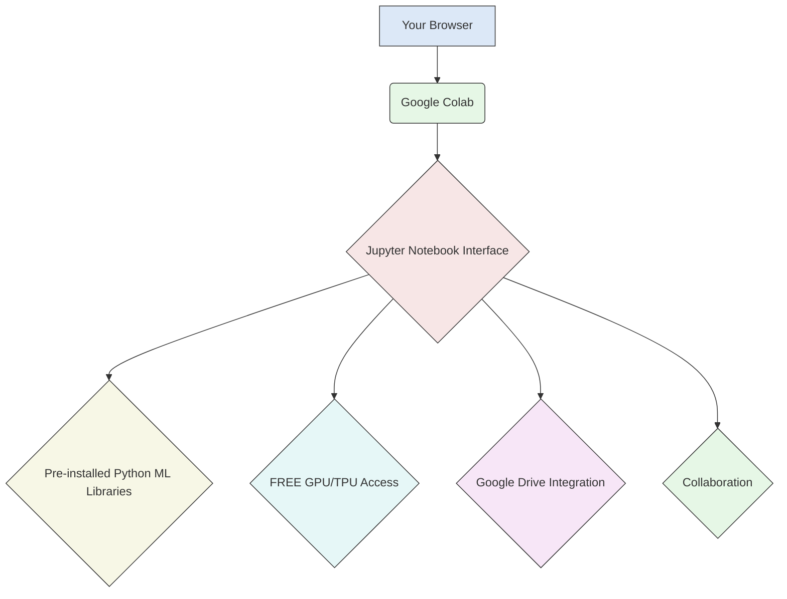
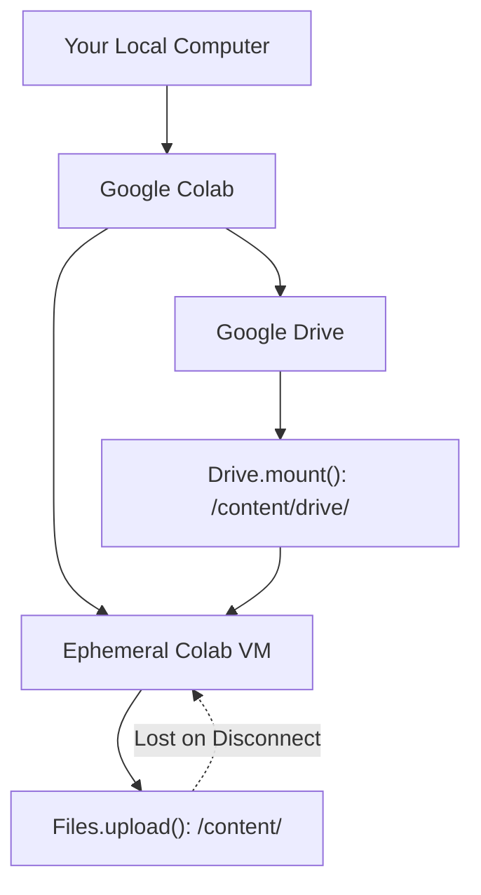

# 📚 Cloud & Big Data Exam Notes: Google Colab (The Lazy Way)

> [!NOTE] This is about a FREE cloud tool for Python, Data Science, and AI. It's basically a "Jupyter Notebook in the cloud." Super useful because it means **no setup** on your computer.

---

## ☁️ Cloud for AI: Why Google Colab?

### What is it?
*   It's a **cloud-based platform** for running [[Jupyter notebooks]] using Python.
*   Designed for **Machine Learning (ML)** and **Data Science**.
*   **It's Google Colab!** (or Colaboratory).
*   **Requirement**: You need a Google account (Gmail).

### Why is it Awesome? (Key Features)
*   **FREE** access to powerful computing:
    *   **GPU** (Graphics Processing Unit) acceleration (for deep learning!).
    *   **TPU** (Tensor Processing Unit) acceleration (Google's custom AI chips!).
*   Comes with **pre-installed libraries** for Data Science and ML (NumPy, pandas, TensorFlow, PyTorch, scikit-learn, etc.). No installation headaches!
*   **No local setup required**: Runs entirely in your web browser.
*   **Real-time collaboration**: Share notebooks, edit together.
*   Integrates directly with **Google Drive** for saving files and notebooks.

### Requirements (Duh!)
*   Valid Google account (Gmail).
*   Modern web browser (Chrome/Firefox).
*   Internet connection (it's cloud, duh!).
*   Basic Python knowledge (you're doing ML, right?).
*   Jupyter experience helps, but not critical.
*   Optional: Google Drive and GitHub accounts (for saving/loading).

---

## 💻 Accessing & Using Google Colab

### Getting In
1.  Go to [https://colab.research.google.com/](https://colab.research.google.com/).
2.  Sign in with your Google account.
3.  Choose:
    *   Start a blank notebook.
    *   Open from Google Drive or GitHub.
    *   Upload a local `.ipynb` file.

### Notebook Structure (Cells!)
*   Notebooks are made of **cells**.
*   **Code cells**: For writing and executing Python code.
*   **Text cells**: For documentation using [[Markdown]] (headings, bold, lists, links, images). Great for explaining your analysis steps.

### Basic Code Execution
*   Type Python code in a code cell.
*   Run a cell: `Shift+Enter` or click the "play" icon.
*   Outputs appear right below the cell.
*   **State is preserved**: Variables and imports from previous cells are available in later cells in the same session.
*   **Restart**: `Runtime > Restart runtime` to clear memory and variables.
*   **Run All**: `Runtime > Run all` to execute all cells from top to bottom.

---

## ⚡ Power Features for ML/Big Data

### Using GPUs and TPUs (This is BIG!)
*   **Crucial for deep learning!**
*   **How**: Go to `Runtime > Change runtime type`. Select `GPU` or `TPU` from the "Hardware accelerator" menu.
*   **Check**: Top-right status bar shows connection type. You can also run `!nvidia-smi` in a code cell to check GPU status.
*   **Time-limited**: Free GPU/TPU resources are not infinite. If idle for too long, Colab might disconnect you. Just reconnect.

### Handling Files & Data

#### Uploading Files (Temporary)
*   Use `from google.colab import files` then `files.upload()`. A file selector dialog pops up.
*   Uploaded files are in the `/content/` directory.
*   **Caveat**: These files **disappear** when your Colab session ends (disconnects).
*   **Quick upload**: Drag-and-drop also works for small files.

#### Mounting Google Drive (Persistent Storage!)
*   **Best for persistent files/large datasets/saving notebooks.**
*   **How**:
    1.  `from google.colab import drive`
    2.  `drive.mount('/content/drive')` (You'll get a link to authenticate with your Google account).
*   **Access**: Files are then accessible like `/content/drive/My Drive/your_folder/your_file.csv`.
*   **Persistent & Synced**: Files saved here stay on your Google Drive and sync.
*   **Unmount**: `drive.flush_and_unmount()` when done.

#### Installing Packages (If not pre-installed)
*   Use `!pip install package-name` in a code cell.
*   The `!` makes it run as a shell command.
*   **Important**: These are **session-specific installs**. If you disconnect, they're lost and you'll need to reinstall next time.
*   Common ones like `numpy`, `pandas`, `matplotlib`, `seaborn` are *already there*.

### Working with Data (pandas!)
*   **pandas** is your best friend for tabular data (like spreadsheets).
*   `import pandas as pd`
*   `df = pd.read_csv('your_file.csv')` (Load data)
*   `df.head()` (See first few rows)
*   `df.describe()` (Get statistics)
*   `df.plot()` (Quick visualization)
*   `df.to_csv('output.csv')` (Export data)

### Visualizing Data
*   Use `matplotlib` and `seaborn` (both pre-installed).
*   `import matplotlib.pyplot as plt`
*   `import seaborn as sns`
*   `plt.plot(x, y)` or `plt.scatter(x, y)` (Basic plots)
*   `sns.heatmap(df.corr())` (Correlation matrix)
*   Plots appear directly in the notebook.

---
You're ready! Colab makes AI accessible without hardware pain.