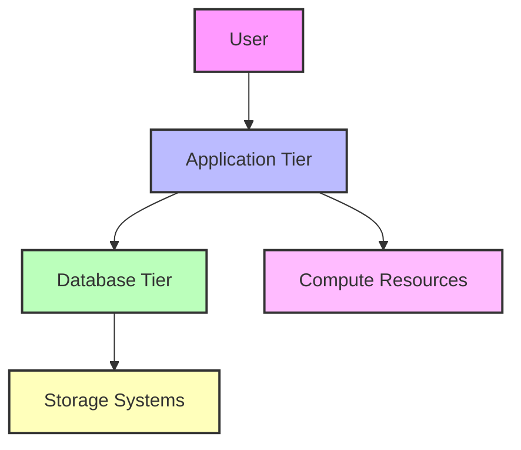
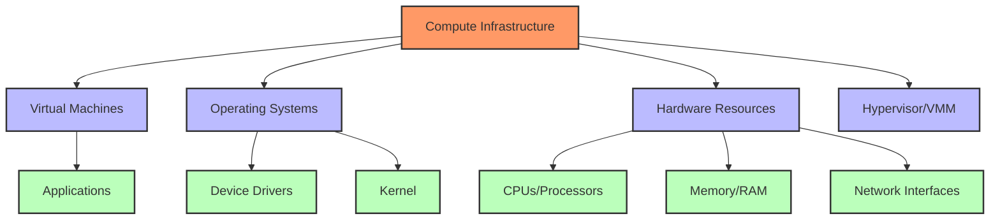
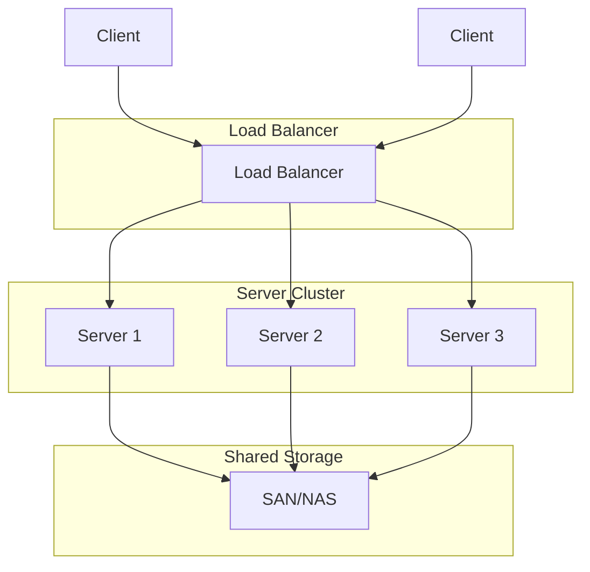
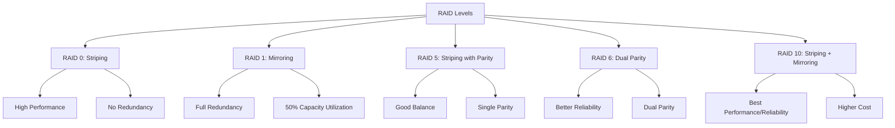

# Classic Data Center (CDC) - Part 1

## Introduction

A Classic Data Center (CDC) is the physical environment where organizations house their critical IT infrastructure. Understanding CDCs is essential for deploying and managing big data solutions effectively.

## Application, DBMS, Compute, and Storage

A data center hosts multiple interconnected components that work together to deliver IT services:

### Applications

- Software programs that users interact with directly
- Examples: Web applications, enterprise software (ERP, CRM), custom business applications
- May be multi-tiered (presentation, business logic, data access layers)

### Database Management Systems (DBMS)

- Software that manages data storage, retrieval, and manipulation
- Examples: Oracle, MySQL, SQL Server, PostgreSQL, MongoDB
- Provides data integrity, security, and transaction management
- In big data contexts, may include specialized systems like Hadoop, Spark

### Compute Resources

- Servers that process instructions and execute applications
- Typically rack-mounted or blade servers in enterprise environments
- Components include CPUs, memory (RAM), network interfaces
- Virtualization often employed to maximize resource utilization

### Storage Systems

- Physical devices and software that house data
- Direct-Attached Storage (DAS): Storage directly connected to servers
- Storage Area Networks (SAN): Dedicated high-speed networks for storage
- Network-Attached Storage (NAS): File-level storage accessed over standard networks

## Key Requirements of a Data Center

Data centers must meet several critical requirements:

### 1. High Availability

- 24/7/365 operation with minimal downtime
- Measured in "nines" (99.9%, 99.99%, 99.999% uptime)
- Requires redundancy in all critical systems

### 2. Reliability

- Consistent performance over time
- Predictable behavior under varying conditions
- Mean Time Between Failures (MTBF) as a key metric

### 3. Scalability

- Ability to grow capacity as needs increase
- Horizontal scaling (adding more servers)
- Vertical scaling (upgrading existing servers)

### 4. Security

- Physical security (access control, surveillance)
- Network security (firewalls, intrusion detection)
- Data security (encryption, authentication)

### 5. Environmental Controls

- Power management (UPS, generators)
- Cooling systems
- Fire suppression

### 6. Efficiency

- Optimized power usage (PUE - Power Usage Effectiveness)
- Space utilization
- Resource management

## Logical Components of Compute Infrastructure

### Operating Systems Layer

- Provides interface between hardware and applications
- Resource allocation and management
- Windows Server, Linux distributions, Unix variants

### Hypervisor/Virtualization Layer

- Type 1 (bare-metal): VMware ESXi, Microsoft Hyper-V, KVM
- Type 2 (hosted): VMware Workstation, Oracle VirtualBox
- Creates and manages virtual machines

### Server Management Layer

- Remote management capabilities (iLO, DRAC, IMM)
- Monitoring and alerting
- Firmware and driver management

## Server Clustering

Server clustering combines multiple servers to work as a single system, providing:

### High Availability Clusters

- Ensure continuity of service if hardware fails
- Automatic failover between nodes
- Examples: Windows Server Failover Clustering, Linux-HA

### Load-Balancing Clusters

- Distribute workloads across multiple servers
- Improve performance and resource utilization
- Examples: F5 BIG-IP, HAProxy, Nginx

### High-Performance Computing Clusters

- Parallel processing of compute-intensive tasks
- Common in scientific computing and big data analysis
- Examples: Beowulf clusters, grid computing

## Storage Systems in Detail

### Storage Hierarchy

Data center storage typically follows a tiered approach:

1. **Tier 0**: Ultra-high performance (NVMe, in-memory)
2. **Tier 1**: Mission-critical data (SSD, high-end SAN)
3. **Tier 2**: Business-critical data (SAS drives, mid-range SAN)
4. **Tier 3**: Less frequently accessed data (SATA drives, NAS)
5. **Tier 4**: Archive/backup (tape, object storage)

### Storage Networking Technologies

- **Fibre Channel (FC)**: High-speed network technology for SANs
- **iSCSI**: SAN protocol that runs over standard IP networks
- **NFS/CIFS**: File-level protocols for NAS access
- **FCoE**: Fibre Channel over Ethernet

## Redundant Array of Independent Disks (RAID)

RAID combines multiple physical disks into logical units to improve performance, reliability, or both.

### RAID Techniques

- **Striping**: Distributing data across multiple disks for improved performance
- **Mirroring**: Creating exact copies of data on separate disks for redundancy
- **Parity**: Special error-correcting information stored to rebuild lost data

### Common RAID Levels

#### RAID 0 (Striping)

- Data striped across multiple disks
- Improved performance but no redundancy
- If one disk fails, all data is lost
- Used for non-critical, high-performance needs

#### RAID 1 (Mirroring)

- Data identically copied to two or more disks
- Full redundancy but only 50% usable capacity
- Simple recovery from disk failures
- Good for critical system volumes

#### RAID 5 (Striping with Parity)

- Data and parity information striped across 3+ disks
- Can survive single disk failure
- Good balance of performance, capacity, and redundancy
- Popular for general-purpose storage

#### RAID 6 (Dual Parity)

- Similar to RAID 5 but with two parity blocks
- Can survive two simultaneous disk failures
- Slightly lower write performance than RAID 5
- Better for larger arrays with many disks

#### RAID 10 (1+0, Mirrored Stripes)

- Combination of RAID 1 and RAID 0
- Excellent performance and reliability
- Higher cost (50% capacity utilization)
- Used for critical, high-performance applications

### RAID's Role in Data Centers

- Provides reliability for storage systems
- Essential for business continuity and disaster recovery
- Performance optimization for I/O-intensive applications
- Foundation for enterprise storage systems

## Intelligent Storage Systems

Modern data centers utilize advanced storage systems with built-in intelligence:

### Key Features

- **Automated tiering**: Moving data between storage tiers based on access patterns
- **Thin provisioning**: Allocating storage on demand rather than up-front
- **Deduplication**: Eliminating duplicate data to save space
- **Compression**: Reducing data size to increase effective capacity
- **Snapshots**: Point-in-time copies for backup and recovery
- **Replication**: Copying data between storage systems for disaster recovery

### Storage Management

- Centralized administration through management software
- Performance monitoring and optimization
- Capacity planning and reporting
- Integration with virtualization platforms

## Business Continuity in CDCs

### Backup Technologies

- Full, incremental, and differential backups
- Snapshots and continuous data protection
- Off-site backup storage

### Disaster Recovery

- Recovery Point Objective (RPO): How much data can be lost
- Recovery Time Objective (RTO): How quickly systems must be restored
- Hot, warm, and cold recovery sites

### Replication Technologies

- Synchronous replication for zero data loss
- Asynchronous replication for longer distances
- Three-site replication for maximum protection

## CDC Management

### Infrastructure Management

- Data center infrastructure management (DCIM) tools
- Asset management and capacity planning
- Power and cooling optimization

### Service Management

- ITIL framework implementation
- Service catalogs and SLAs
- Change management and configuration control

### Monitoring and Alerting

- Performance monitoring of all components
- Automated alerting based on thresholds
- Trend analysis and predictive maintenance

---
## Summary

Classic Data Centers provide the foundation for enterprise IT and big data operations through:

- Application, database, compute, and storage integration
- Reliable and redundant infrastructure design
- Advanced storage technologies like RAID and intelligent storage systems
- Comprehensive management and monitoring capabilities

Understanding these fundamentals is essential for designing, deploying, and maintaining effective big data solutions in enterprise environments.