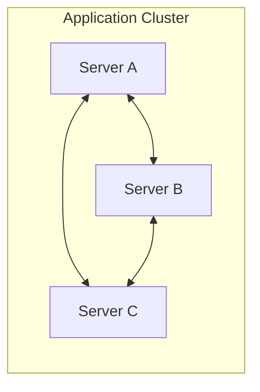
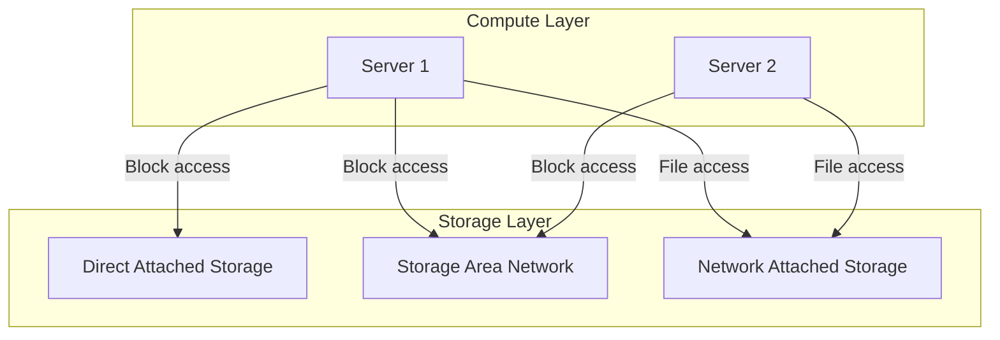
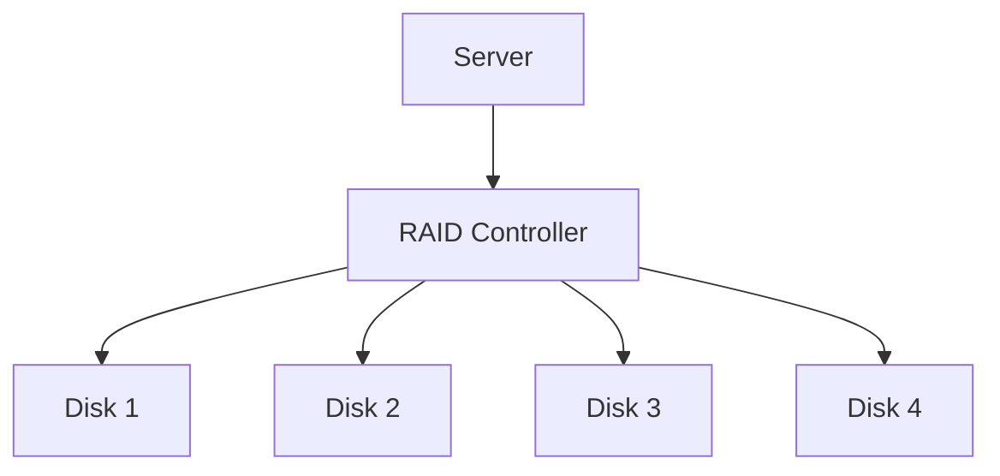
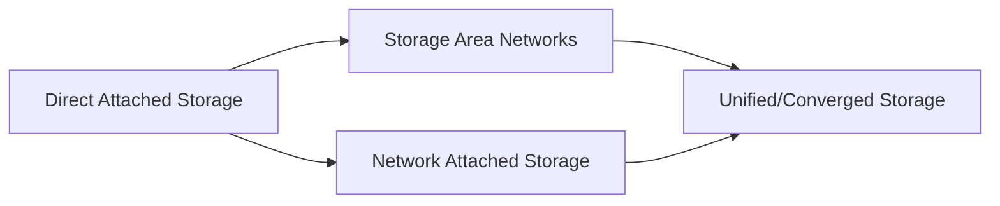
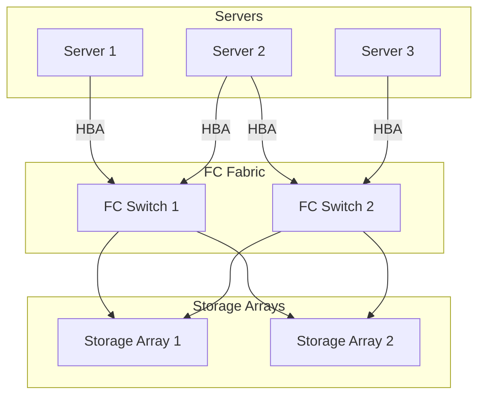
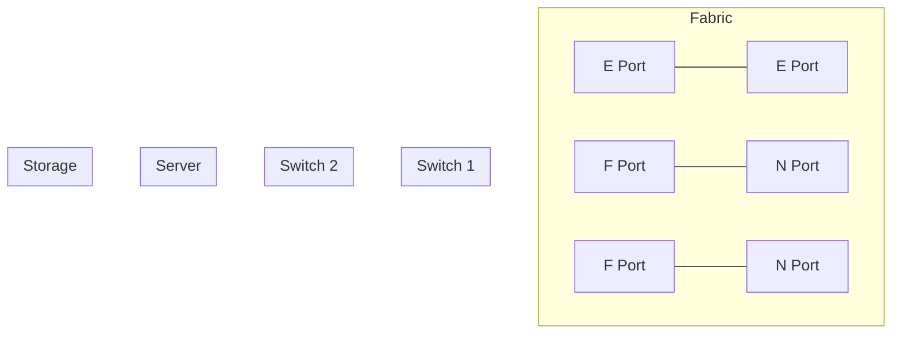
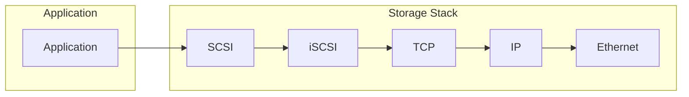
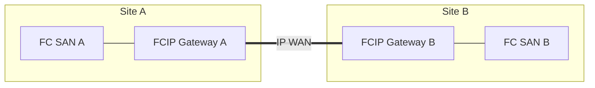
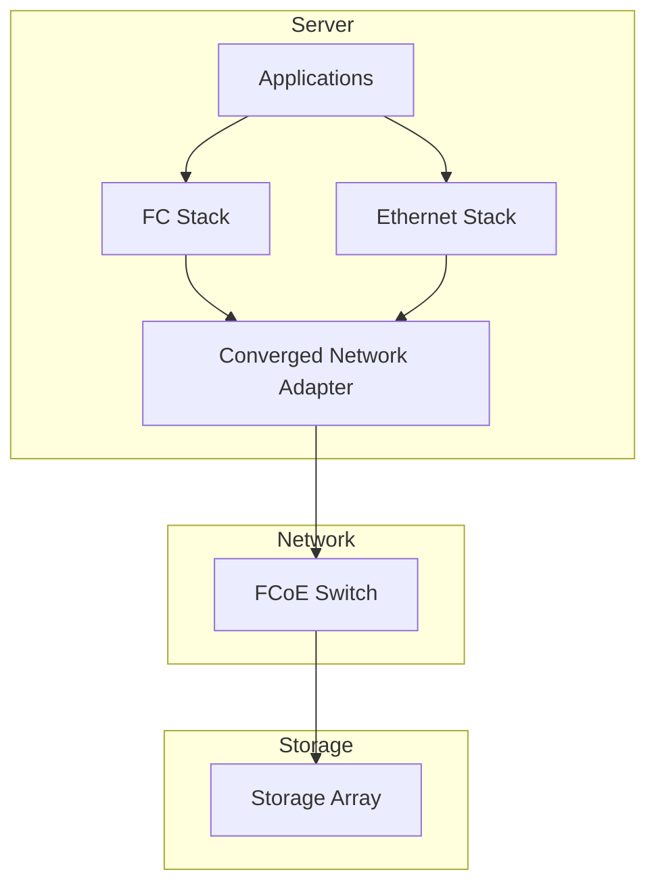
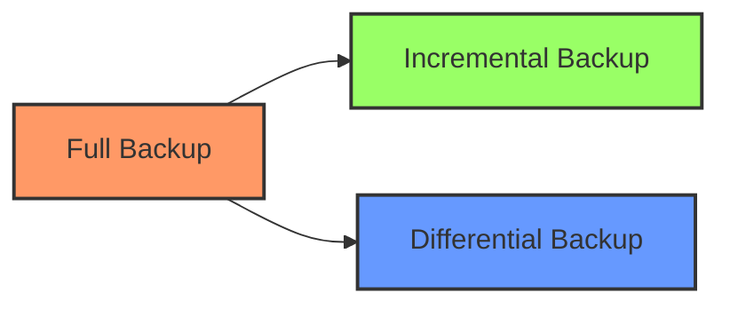

# Classic Data Center (CDC) - Part 2

## Introduction to Data Center Communications

In a data center environment, communication flows occur between multiple components that must operate harmoniously to deliver IT services. These communication patterns can be broadly categorized into two types.

## Compute to Compute Communication

This involves server-to-server communication for tasks like:

- **Application clustering**: Servers working together to provide high availability
- **Distributed processing**: Breaking large workloads across multiple servers
- **Database replication**: Syncing data between primary and backup database servers
- **Virtual machine migration**: Moving VMs between physical hosts

Communication typically occurs over standard network protocols:

- TCP/IP for most application-level communication
- Specialized protocols for clustering (e.g., Heartbeat)
- Low-latency interconnects for high-performance computing (InfiniBand, RoCE)

## Compute to Storage Communication

This involves how servers access and interact with storage resources:

Storage access can be categorized by the type of data access:

1. **Block-level access**: The server addresses raw storage blocks directly
    
    - Used by: Operating systems, databases, virtualization
    - Common interfaces: SCSI, SAS, SATA, Fibre Channel
2. **File-level access**: The server requests files from a file system managed externally
    
    - Used by: End-user applications, content repositories
    - Common protocols: NFS, SMB/CIFS, HTTP

## Common Communication Protocols

### Block Storage Protocols

- **SCSI (Small Computer System Interface)**
    
    - Foundation protocol for block storage
    - Various physical implementations (Parallel SCSI, SAS, etc.)
- **ATA/SATA/SAS**
    
    - Serial protocols for connecting to disk drives
    - SAS offers higher performance and reliability than SATA
- **Fibre Channel Protocol (FCP)**
    
    - High-performance block storage protocol
    - Runs over Fibre Channel transport
- **iSCSI (Internet SCSI)**
    
    - Encapsulates SCSI commands in TCP/IP packets
    - Allows block storage access over standard IP networks

### File Storage Protocols

- **NFS (Network File System)**
    - Unix/Linux standard for file sharing
    - Lightweight and widely supported
- **SMB/CIFS (Server Message Block/Common Internet File System)**
    - Windows standard for file sharing
    - Also supported on Linux/Unix with Samba

## Direct Attached Storage (DAS)

DAS represents the simplest storage architecture, where storage devices connect directly to a server without a storage network in between.

### Key Characteristics of DAS

- **Direct Connection**: Storage devices physically attached to the server
- **No Network**: No storage network infrastructure required
- **Single Server Access**: Storage typically accessible only by the host server
- **Common Interfaces**: SAS, SATA, SCSI

### Implementations of DAS

1. **Internal Storage**
    
    - Hard drives/SSDs installed inside the server chassis
    - Limited by physical space within the server
2. **External Storage**
    
    - External storage enclosures connected to servers
    - Connected via SAS, eSATA, USB, or Thunderbolt
    - Provides additional capacity beyond internal limitations
3. **JBOD (Just a Bunch Of Disks)**
    
    - Simple disk arrays without advanced features
    - May be combined with software RAID for redundancy
4. **External RAID Systems**
    
    - Hardware RAID implementation in external enclosure
    - Greater capacity and redundancy than internal storage

### Advantages of DAS

- **Simplicity**: Easy to set up and manage
- **Low Cost**: No need for specialized networking equipment
- **Performance**: Direct connection offers low latency
- **Security**: Physical isolation from network-based attacks

### Limitations of DAS

- **Limited Scalability**: Constrained by server connection ports
- **No Sharing**: Storage typically accessible by only one server
- **Resource Silos**: Can lead to underutilized storage across servers
- **Limited Distance**: Short cable length restrictions
- **Limited Redundancy Options**: Primarily dependent on RAID

## Emergence of Storage Networking Technologies

As IT environments grew more complex, the limitations of DAS became apparent, leading to the development of networked storage solutions.

### The Evolution Path

### Drivers for Storage Networking Development

1. **Resource Utilization**
    
    - Need to share storage resources among multiple servers
    - Eliminate "islands" of underutilized storage
2. **Data Centralization**
    
    - Consolidate data management
    - Improve backup and recovery processes
3. **Scalability Requirements**
    
    - Add capacity without server disruption
    - Scale beyond individual server limitations
4. **High Availability Needs**
    
    - Enable clustered server access to shared storage
    - Support business continuity and disaster recovery

### Key Storage Networking Technologies

1. **Storage Area Networks (SAN)**
    
    - High-speed networks dedicated to storage traffic
    - Block-level access to shared storage resources
    - Common technologies: Fibre Channel, iSCSI, FCoE
2. **Network Attached Storage (NAS)**
    
    - File-level storage access over standard networks
    - Simplified file sharing between multiple systems
    - Common protocols: NFS, SMB/CIFS
3. **Unified Storage**
    
    - Combined SAN and NAS capabilities in single platform
    - Protocol flexibility (block and file access)

## Fibre Channel SAN (FC SAN)

Fibre Channel SANs represent a specialized high-performance network dedicated to storage traffic.

### Key Components of FC SAN

1. **Host Bus Adapters (HBAs)**
    
    - Special network cards in servers for FC connectivity
    - Connect servers to the FC network
    - Run FC protocol stack with initiator functionality
2. **FC Switches**
    
    - Create the fabric that connects servers to storage
    - Provide intelligent routing of FC frames
    - Support zoning and other security features
    - Examples: Cisco MDS, Brocade, IBM SAN switches
3. **Storage Arrays**
    
    - Enterprise storage systems with FC connectivity
    - Contain multiple disk drives and controllers
    - Present storage as logical units (LUNs)
    - Examples: Dell EMC PowerMax, NetApp AFF, HPE Primera
4. **FC Cables**
    
    - Optical fiber (most common) or copper cabling
    - Various distance capabilities based on cable type
    - Different connector types (LC, SC)

### Fibre Channel Fabric

A Fibre Channel fabric is the switched network infrastructure that connects servers and storage:

1. **Fabric Topology**
    
    - Most common FC SAN deployment model
    - All devices connect to switches forming a fabric
    - Provides multiple simultaneous connections
    - Scales to thousands of ports
2. **Core-Edge Topology**
    
    - Common design for larger environments
    - Core switches provide high-bandwidth backbone
    - Edge switches connect to servers and storage
3. **Redundant Fabric Design**
    
    - Typically deployed with dual redundant fabrics
    - Each server and storage device connects to both fabrics
    - Eliminates single points of failure

### Technical Characteristics

- **Performance**: 4, 8, 16, 32, 64 Gbps link speeds
- **Low Latency**: Designed specifically for storage traffic
- **Lossless**: Guaranteed in-order delivery of frames
- **Distance**: Support for extended distances with appropriate optics

### FC SAN Features

1. **Zoning**
    
    - Security mechanism to control device communication
    - Only devices in the same zone can communicate
    - Can be port-based or WWN-based (World Wide Name)
2. **LUN Masking**
    
    - Controls which servers can see which storage LUNs
    - Implemented at the storage array level
    - Works in conjunction with zoning
3. **Fabric Services**
    
    - Name Server: Maintains directory of devices
    - Management Interface: For configuration and monitoring
    - Routing: For multi-switch environments

## Fibre Channel Port Types

Fibre Channel defines different port types that serve specific roles in the fabric:

### Common FC Port Types

1. **N_Port (Node Port)**
    
    - End device port (in servers or storage)
    - Connects to an F_Port on a switch
    - Initiates or receives FC communications
2. **F_Port (Fabric Port)**
    
    - Switch port that connects to an end device (N_Port)
    - Provides fabric services to the connected device
    - Handles login and registration services
3. **E_Port (Expansion Port)**
    
    - Inter-switch link (ISL) between FC switches
    - Extends the fabric across multiple switches
    - Carries all traffic between switches
4. **FL_Port/NL_Port**
    
    - Ports used in FC arbitrated loop (older topology)
    - Less common in modern implementations
5. **G_Port (Generic Port)**
    
    - Can function as either E_Port or F_Port
    - Automatically determines type based on what's connected

## IP-SAN Technologies

While Fibre Channel dominated early SAN deployments, IP-based SAN technologies have gained popularity due to several advantages:

### Why IP for Storage Transport?

- **Easier Management**: Leveraging familiar IP networking skills
- **Cost Efficiency**: Using existing network infrastructure
- **Interoperability**: Better multi-vendor support
- **Distance**: Native support for long-distance connectivity
- **Security**: Mature security options available for IP networks

### iSCSI (Internet SCSI)

iSCSI encapsulates SCSI commands in TCP/IP packets, allowing block storage traffic over standard IP networks:

#### iSCSI Components

- **iSCSI Initiator**: Software or hardware component in the server that initiates connections
- **iSCSI Target**: Storage device that responds to initiator requests
- **iSCSI HBA**: Specialized network card that offloads iSCSI processing
- **TOE (TCP/IP Offload Engine)**: Hardware that offloads TCP/IP processing

#### iSCSI Topologies

1. **Native iSCSI**
    
    - Direct connection between iSCSI initiators and targets
    - No Fibre Channel components involved
2. **Bridged iSCSI**
    
    - iSCSI initiators connect to FC storage via a bridge/gateway
    - Gateway translates between iSCSI and FC protocols

### FCIP (Fibre Channel over IP)

FCIP creates tunnels that connect separate Fibre Channel SANs over IP networks:

#### FCIP Characteristics

- **Distance Extension**: Primary use case is connecting FC SANs across distances
- **Point-to-Point**: Creates virtual FC links between separated fabrics
- **Tunneling**: Encapsulates complete FC frames within IP packets
- **Common Use**: Disaster recovery and data replication between sites

## FCoE (Fibre Channel over Ethernet)

FCoE encapsulates Fibre Channel frames for transport over enhanced Ethernet networks, allowing consolidation of SAN and LAN traffic.

### FCoE Architecture

### Key Components of FCoE

1. **Converged Network Adapter (CNA)**
    
    - Combines functions of NIC and FC HBA
    - Handles both data networking and storage networking
    - Provides hardware offload for both protocols
2. **FCoE Switch**
    
    - Contains Ethernet bridge and Fibre Channel Forwarder (FCF)
    - FCF handles encapsulation/de-encapsulation of FC frames
    - Provides seamless integration with FC fabrics
3. **Converged Enhanced Ethernet (CEE)**
    
    - Extensions to standard Ethernet to eliminate its lossy nature
    - Provides lossless transport required for storage traffic
    - Features include priority-based flow control and enhanced transmission selection

### Benefits of FCoE

- **Reduced Hardware**: Fewer adapters, cables, and switches
- **Lower Power/Cooling**: Less equipment means reduced environmental requirements
- **Simplified Management**: Consolidated infrastructure
- **Cost Savings**: Lower capital and operational expenditures
- **Seamless Integration**: Works with existing FC infrastructure

## Business Continuity in the Data Center

Business continuity (BC) ensures continued operation of business functions during and after disruptions.

### Key Business Continuity Terminologies

1. **Disaster Recovery (DR)**
    
    - Process of restoring systems, data, and infrastructure
    - Often focused on IT aspects of business continuity
2. **Recovery Sites**
    
    - **Hot Site**: Fully equipped alternate location
        
        - All required hardware and software running
        - Immediate takeover possible
        - Highest cost option
    - **Cold Site**: Minimal infrastructure
        
        - Basic facilities but equipment not activated
        - Longer recovery time
        - Lower cost option
3. **Clustering**
    
    - Group of servers operating as a single system
    - Provides high availability through redundancy
    - Automatic failover capabilities

### Backup Granularity

Different backup approaches based on the amount of data captured:

1. **Full Backup**
    
    - Complete copy of all selected data
    - Independent of previous backups
    - Longest backup time but simplest restore
2. **Incremental Backup**
    
    - Only data changed since last backup (full or incremental)
    - Faster backup but more complex restore
    - Requires all incrementals since last full backup
3. **Differential Backup**
    
    - All changes since last full backup
    - Medium backup time and restore complexity
    - Only requires full + latest differential for restore

### Backup Components and Operation

A typical backup infrastructure includes:

1. **Backup Server/Media Server**
    
    - Controls backup operations
    - Manages backup schedules and policies
    - Tracks what has been backed up
2. **Backup Clients**
    
    - Software on systems to be protected
    - Communicates with backup server
    - Identifies and transfers data to be backed up
3. **Backup Storage**
    
    - Disk-based backup systems
    - Tape libraries
    - Cloud storage targets
4. **Backup Catalog**
    
    - Database of all backed-up files and their locations
    - Critical for efficient restore operations

### Deduplication Technologies

Deduplication eliminates redundant data to reduce storage requirements:

#### Types of Deduplication

1. **Source-side Deduplication**
    
    - Performed at the client before data transfer
    - Reduces network bandwidth requirements
    - Increases CPU load on source systems
2. **Target-side Deduplication**
    
    - Performed at the backup storage system
    - No impact on source systems
    - Requires full data transfer over network

#### Deduplication Methods

1. **File-level Deduplication**
    
    - Eliminates duplicate entire files
    - Simple but less effective
2. **Block-level Deduplication**
    
    - Works with fixed or variable-sized data blocks
    - More efficient than file-level
    - Common in enterprise backup solutions
3. **Byte-level Deduplication**
    
    - Most granular approach
    - Highest CPU requirements
    - Best storage efficiency

## CDC Management

Managing a data center effectively requires a structured approach to key operational areas.

### Key Management Activities in a CDC

1. **Monitoring and Alerting**
    
    - Tracking system health and performance
    - Proactive identification of issues
    - Alerting based on severity levels:
        - Information alerts: Normal operations requiring no action
        - Warning alerts: Require attention but not critical
        - Fatal alerts: Critical issues needing immediate response
2. **Reporting**
    
    - **Capacity Planning Reports**: Track resource utilization trends
    - **Chargeback Reports**: Allocation of resources by department
    - **Performance Reports**: System and component performance metrics
3. **Availability Management**
    
    - Eliminating single points of failure
    - Implementing redundant components
    - Configuring multipathing for storage access
    - Establishing backup and replication processes
4. **Capacity Management**
    
    - Planning for future growth
    - Optimizing current resource utilization
    - Avoiding resource constraints
5. **Performance Management**
    
    - Optimizing system performance
    - Identifying and resolving bottlenecks
    - Meeting service level requirements
6. **Security Management**
    
    - Controlling access to resources
    - Monitoring for unauthorized activity
    - Implementing security best practices

### Information Lifecycle Management (ILM)

ILM addresses the changing value of information over time and manages it accordingly:

#### Challenges in Information Management

1. **Exploding Digital Universe**
    
    - Exponential growth in data volume
    - Increasing variety of data types
2. **Increasing Dependency on Information**
    
    - Business processes rely on timely access to data
    - Strategic use of information affects competitive advantage
3. **Changing Value of Information**
    
    - Information value typically declines over time
    - Different retention requirements for different data types

ILM provides a framework for managing data throughout its lifecycle, from creation through archival or deletion, ensuring appropriate storage resources are used based on the data's current value and access requirements.

## Summary

Classic Data Centers provide the foundation for enterprise computing through:

- Diverse communication protocols connecting compute and storage resources
- Evolution from direct-attached to networked storage technologies
- Specialized storage networks like Fibre Channel SANs with robust performance
- IP-based storage technologies providing flexibility and cost advantages
- Converged infrastructure like FCoE simplifying data center architecture
- Comprehensive business continuity and backup strategies
- Structured management practices ensuring availability and performance

Understanding these interconnection technologies and management approaches is essential for designing and operating effective data center environments that can support demanding enterprise workloads.